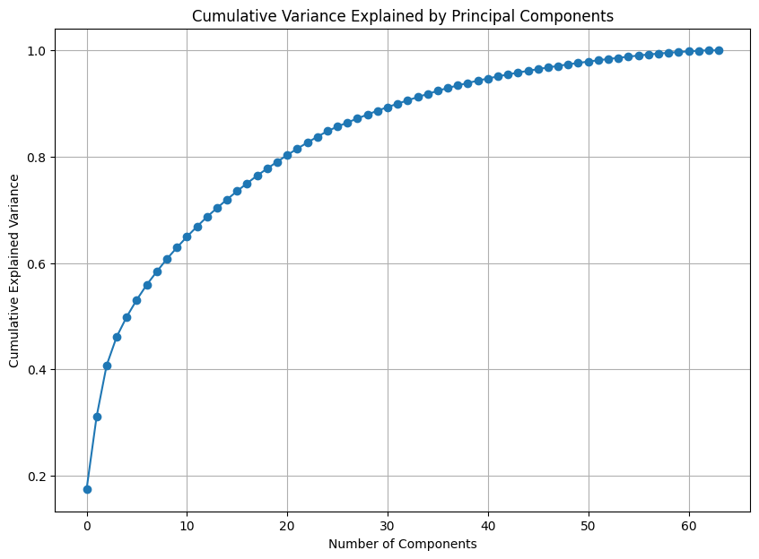

# Project: Identify Customer Segments

In this project, you will apply unsupervised learning techniques to identify segments of the population that form the core customer base for a mail-order sales company in Germany. These segments can then be used to direct marketing campaigns towards audiences that will have the highest expected rate of returns. The data that you will use has been provided by our partners at Bertelsmann Arvato Analytics, and represents a real-life data science task.

This notebook will help you complete this task by providing a framework within which you will perform your analysis steps. In each step of the project, you will see some text describing the subtask that you will perform, followed by one or more code cells for you to complete your work. **Feel free to add additional code and markdown cells as you go along so that you can explore everything in precise chunks.** The code cells provided in the base template will outline only the major tasks, and will usually not be enough to cover all of the minor tasks that comprise it.

It should be noted that while there will be precise guidelines on how you should handle certain tasks in the project, there will also be places where an exact specification is not provided. **There will be times in the project where you will need to make and justify your own decisions on how to treat the data.** These are places where there may not be only one way to handle the data. In real-life tasks, there may be many valid ways to approach an analysis task. One of the most important things you can do is clearly document your approach so that other scientists can understand the decisions you've made.

At the end of most sections, there will be a Markdown cell labeled **Discussion**. In these cells, you will report your findings for the completed section, as well as document the decisions that you made in your approach to each subtask. **Your project will be evaluated not just on the code used to complete the tasks outlined, but also your communication about your observations and conclusions at each stage.**


```python
# import libraries here; add more as necessary
import numpy as np
import pandas as pd
import matplotlib.pyplot as plt
import seaborn as sns
from tqdm import tqdm
import os
import re
from sklearn.preprocessing import StandardScaler
from sklearn.decomposition import PCA
from sklearn.cluster import KMeans
from matplotlib.ticker import FuncFormatter

random_state=13

# magic word for producing visualizations in notebook
%matplotlib inline

'''
Import note: The classroom currently uses sklearn version 0.19.
If you need to use an imputer, it is available in sklearn.preprocessing.Imputer,
instead of sklearn.impute as in newer versions of sklearn.
'''
```


    '\nImport note: The classroom currently uses sklearn version 0.19.\nIf you need to use an imputer, it is available in sklearn.preprocessing.Imputer,\ninstead of sklearn.impute as in newer versions of sklearn.\n'


### Step 0: Load the Data

There are four files associated with this project (not including this one):

- `Udacity_AZDIAS_Subset.csv`: Demographics data for the general population of Germany; 891211 persons (rows) x 85 features (columns).
- `Udacity_CUSTOMERS_Subset.csv`: Demographics data for customers of a mail-order company; 191652 persons (rows) x 85 features (columns).
- `Data_Dictionary.md`: Detailed information file about the features in the provided datasets.
- `AZDIAS_Feature_Summary.csv`: Summary of feature attributes for demographics data; 85 features (rows) x 4 columns

Each row of the demographics files represents a single person, but also includes information outside of individuals, including information about their household, building, and neighborhood. You will use this information to cluster the general population into groups with similar demographic properties. Then, you will see how the people in the customers dataset fit into those created clusters. The hope here is that certain clusters are over-represented in the customers data, as compared to the general population; those over-represented clusters will be assumed to be part of the core userbase. This information can then be used for further applications, such as targeting for a marketing campaign.

To start off with, load in the demographics data for the general population into a pandas DataFrame, and do the same for the feature attributes summary. Note for all of the `.csv` data files in this project: they're semicolon (`;`) delimited, so you'll need an additional argument in your [`read_csv()`](https://pandas.pydata.org/pandas-docs/stable/generated/pandas.read_csv.html) call to read in the data properly. Also, considering the size of the main dataset, it may take some time for it to load completely.

Once the dataset is loaded, it's recommended that you take a little bit of time just browsing the general structure of the dataset and feature summary file. You'll be getting deep into the innards of the cleaning in the first major step of the project, so gaining some general familiarity can help you get your bearings.


```python
# Load in the general demographics data.
azdias = pd.read_csv('Udacity_AZDIAS_Subset.csv', sep=';')

# Load in the feature summary file.
feat_info = pd.read_csv('AZDIAS_Feature_Summary.csv', sep=';') 
```


```python
# Check the structure of the data after it's loaded (e.g. print the number of
# rows and columns, print the first few rows).
print("AZDIAS numrows:", azdias.shape[0])
azdias.info()
feat_info.info()
```

    AZDIAS numrows: 891221
    <class 'pandas.core.frame.DataFrame'>
    RangeIndex: 891221 entries, 0 to 891220
    Data columns (total 85 columns):
     #   Column                 Non-Null Count   Dtype  
    ---  ------                 --------------   -----  
     0   AGER_TYP               891221 non-null  int64  
     1   ALTERSKATEGORIE_GROB   891221 non-null  int64  
     2   ANREDE_KZ              891221 non-null  int64  
     3   CJT_GESAMTTYP          886367 non-null  float64
     4   FINANZ_MINIMALIST      891221 non-null  int64  
     5   FINANZ_SPARER          891221 non-null  int64  
     6   FINANZ_VORSORGER       891221 non-null  int64  
     7   FINANZ_ANLEGER         891221 non-null  int64  
     8   FINANZ_UNAUFFAELLIGER  891221 non-null  int64  
     9   FINANZ_HAUSBAUER       891221 non-null  int64  
     10  FINANZTYP              891221 non-null  int64  
     11  GEBURTSJAHR            891221 non-null  int64  
     12  GFK_URLAUBERTYP        886367 non-null  float64
     13  GREEN_AVANTGARDE       891221 non-null  int64  
     14  HEALTH_TYP             891221 non-null  int64  
     15  LP_LEBENSPHASE_FEIN    886367 non-null  float64
     16  LP_LEBENSPHASE_GROB    886367 non-null  float64
     17  LP_FAMILIE_FEIN        886367 non-null  float64
     18  LP_FAMILIE_GROB        886367 non-null  float64
     19  LP_STATUS_FEIN         886367 non-null  float64
     20  LP_STATUS_GROB         886367 non-null  float64
     21  NATIONALITAET_KZ       891221 non-null  int64  
     22  PRAEGENDE_JUGENDJAHRE  891221 non-null  int64  
     23  RETOURTYP_BK_S         886367 non-null  float64
     24  SEMIO_SOZ              891221 non-null  int64  
     25  SEMIO_FAM              891221 non-null  int64  
     26  SEMIO_REL              891221 non-null  int64  
     27  SEMIO_MAT              891221 non-null  int64  
     28  SEMIO_VERT             891221 non-null  int64  
     29  SEMIO_LUST             891221 non-null  int64  
     30  SEMIO_ERL              891221 non-null  int64  
     31  SEMIO_KULT             891221 non-null  int64  
     32  SEMIO_RAT              891221 non-null  int64  
     33  SEMIO_KRIT             891221 non-null  int64  
     34  SEMIO_DOM              891221 non-null  int64  
     35  SEMIO_KAEM             891221 non-null  int64  
     36  SEMIO_PFLICHT          891221 non-null  int64  
     37  SEMIO_TRADV            891221 non-null  int64  
     38  SHOPPER_TYP            891221 non-null  int64  
     39  SOHO_KZ                817722 non-null  float64
     40  TITEL_KZ               817722 non-null  float64
     41  VERS_TYP               891221 non-null  int64  
     42  ZABEOTYP               891221 non-null  int64  
     43  ALTER_HH               817722 non-null  float64
     44  ANZ_PERSONEN           817722 non-null  float64
     45  ANZ_TITEL              817722 non-null  float64
     46  HH_EINKOMMEN_SCORE     872873 non-null  float64
     47  KK_KUNDENTYP           306609 non-null  float64
     48  W_KEIT_KIND_HH         783619 non-null  float64
     49  WOHNDAUER_2008         817722 non-null  float64
     50  ANZ_HAUSHALTE_AKTIV    798073 non-null  float64
     51  ANZ_HH_TITEL           794213 non-null  float64
     52  GEBAEUDETYP            798073 non-null  float64
     53  KONSUMNAEHE            817252 non-null  float64
     54  MIN_GEBAEUDEJAHR       798073 non-null  float64
     55  OST_WEST_KZ            798073 non-null  object 
     56  WOHNLAGE               798073 non-null  float64
     57  CAMEO_DEUG_2015        792242 non-null  object 
     58  CAMEO_DEU_2015         792242 non-null  object 
     59  CAMEO_INTL_2015        792242 non-null  object 
     60  KBA05_ANTG1            757897 non-null  float64
     61  KBA05_ANTG2            757897 non-null  float64
     62  KBA05_ANTG3            757897 non-null  float64
     63  KBA05_ANTG4            757897 non-null  float64
     64  KBA05_BAUMAX           757897 non-null  float64
     65  KBA05_GBZ              757897 non-null  float64
     66  BALLRAUM               797481 non-null  float64
     67  EWDICHTE               797481 non-null  float64
     68  INNENSTADT             797481 non-null  float64
     69  GEBAEUDETYP_RASTER     798066 non-null  float64
     70  KKK                    770025 non-null  float64
     71  MOBI_REGIO             757897 non-null  float64
     72  ONLINE_AFFINITAET      886367 non-null  float64
     73  REGIOTYP               770025 non-null  float64
     74  KBA13_ANZAHL_PKW       785421 non-null  float64
     75  PLZ8_ANTG1             774706 non-null  float64
     76  PLZ8_ANTG2             774706 non-null  float64
     77  PLZ8_ANTG3             774706 non-null  float64
     78  PLZ8_ANTG4             774706 non-null  float64
     79  PLZ8_BAUMAX            774706 non-null  float64
     80  PLZ8_HHZ               774706 non-null  float64
     81  PLZ8_GBZ               774706 non-null  float64
     82  ARBEIT                 794005 non-null  float64
     83  ORTSGR_KLS9            794005 non-null  float64
     84  RELAT_AB               794005 non-null  float64
    dtypes: float64(49), int64(32), object(4)
    memory usage: 578.0+ MB
    <class 'pandas.core.frame.DataFrame'>
    RangeIndex: 85 entries, 0 to 84
    Data columns (total 4 columns):
     #   Column              Non-Null Count  Dtype 
    ---  ------              --------------  ----- 
     0   attribute           85 non-null     object
     1   information_level   85 non-null     object
     2   type                85 non-null     object
     3   missing_or_unknown  85 non-null     object
    dtypes: object(4)
    memory usage: 2.8+ KB


```python
azdias.head()
```


<div>
<style scoped>
    .dataframe tbody tr th:only-of-type {
        vertical-align: middle;
    }

    .dataframe tbody tr th {
        vertical-align: top;
    }

    .dataframe thead th {
        text-align: right;
    }
</style>
<table border="1" class="dataframe">
  <thead>
    <tr style="text-align: right;">
      <th></th>
      <th>AGER_TYP</th>
      <th>ALTERSKATEGORIE_GROB</th>
      <th>ANREDE_KZ</th>
      <th>CJT_GESAMTTYP</th>
      <th>FINANZ_MINIMALIST</th>
      <th>FINANZ_SPARER</th>
      <th>FINANZ_VORSORGER</th>
      <th>FINANZ_ANLEGER</th>
      <th>FINANZ_UNAUFFAELLIGER</th>
      <th>FINANZ_HAUSBAUER</th>
      <th>...</th>
      <th>PLZ8_ANTG1</th>
      <th>PLZ8_ANTG2</th>
      <th>PLZ8_ANTG3</th>
      <th>PLZ8_ANTG4</th>
      <th>PLZ8_BAUMAX</th>
      <th>PLZ8_HHZ</th>
      <th>PLZ8_GBZ</th>
      <th>ARBEIT</th>
      <th>ORTSGR_KLS9</th>
      <th>RELAT_AB</th>
    </tr>
  </thead>
  <tbody>
    <tr>
      <th>0</th>
      <td>-1</td>
      <td>2</td>
      <td>1</td>
      <td>2.0</td>
      <td>3</td>
      <td>4</td>
      <td>3</td>
      <td>5</td>
      <td>5</td>
      <td>3</td>
      <td>...</td>
      <td>NaN</td>
      <td>NaN</td>
      <td>NaN</td>
      <td>NaN</td>
      <td>NaN</td>
      <td>NaN</td>
      <td>NaN</td>
      <td>NaN</td>
      <td>NaN</td>
      <td>NaN</td>
    </tr>
    <tr>
      <th>1</th>
      <td>-1</td>
      <td>1</td>
      <td>2</td>
      <td>5.0</td>
      <td>1</td>
      <td>5</td>
      <td>2</td>
      <td>5</td>
      <td>4</td>
      <td>5</td>
      <td>...</td>
      <td>2.0</td>
      <td>3.0</td>
      <td>2.0</td>
      <td>1.0</td>
      <td>1.0</td>
      <td>5.0</td>
      <td>4.0</td>
      <td>3.0</td>
      <td>5.0</td>
      <td>4.0</td>
    </tr>
    <tr>
      <th>2</th>
      <td>-1</td>
      <td>3</td>
      <td>2</td>
      <td>3.0</td>
      <td>1</td>
      <td>4</td>
      <td>1</td>
      <td>2</td>
      <td>3</td>
      <td>5</td>
      <td>...</td>
      <td>3.0</td>
      <td>3.0</td>
      <td>1.0</td>
      <td>0.0</td>
      <td>1.0</td>
      <td>4.0</td>
      <td>4.0</td>
      <td>3.0</td>
      <td>5.0</td>
      <td>2.0</td>
    </tr>
    <tr>
      <th>3</th>
      <td>2</td>
      <td>4</td>
      <td>2</td>
      <td>2.0</td>
      <td>4</td>
      <td>2</td>
      <td>5</td>
      <td>2</td>
      <td>1</td>
      <td>2</td>
      <td>...</td>
      <td>2.0</td>
      <td>2.0</td>
      <td>2.0</td>
      <td>0.0</td>
      <td>1.0</td>
      <td>3.0</td>
      <td>4.0</td>
      <td>2.0</td>
      <td>3.0</td>
      <td>3.0</td>
    </tr>
    <tr>
      <th>4</th>
      <td>-1</td>
      <td>3</td>
      <td>1</td>
      <td>5.0</td>
      <td>4</td>
      <td>3</td>
      <td>4</td>
      <td>1</td>
      <td>3</td>
      <td>2</td>
      <td>...</td>
      <td>2.0</td>
      <td>4.0</td>
      <td>2.0</td>
      <td>1.0</td>
      <td>2.0</td>
      <td>3.0</td>
      <td>3.0</td>
      <td>4.0</td>
      <td>6.0</td>
      <td>5.0</td>
    </tr>
  </tbody>
</table>
<p>5 rows × 85 columns</p>
</div>


```python
feat_info.head()
```


<div>
<style scoped>
    .dataframe tbody tr th:only-of-type {
        vertical-align: middle;
    }

    .dataframe tbody tr th {
        vertical-align: top;
    }

    .dataframe thead th {
        text-align: right;
    }
</style>
<table border="1" class="dataframe">
  <thead>
    <tr style="text-align: right;">
      <th></th>
      <th>attribute</th>
      <th>information_level</th>
      <th>type</th>
      <th>missing_or_unknown</th>
    </tr>
  </thead>
  <tbody>
    <tr>
      <th>0</th>
      <td>AGER_TYP</td>
      <td>person</td>
      <td>categorical</td>
      <td>[-1,0]</td>
    </tr>
    <tr>
      <th>1</th>
      <td>ALTERSKATEGORIE_GROB</td>
      <td>person</td>
      <td>ordinal</td>
      <td>[-1,0,9]</td>
    </tr>
    <tr>
      <th>2</th>
      <td>ANREDE_KZ</td>
      <td>person</td>
      <td>categorical</td>
      <td>[-1,0]</td>
    </tr>
    <tr>
      <th>3</th>
      <td>CJT_GESAMTTYP</td>
      <td>person</td>
      <td>categorical</td>
      <td>[0]</td>
    </tr>
    <tr>
      <th>4</th>
      <td>FINANZ_MINIMALIST</td>
      <td>person</td>
      <td>ordinal</td>
      <td>[-1]</td>
    </tr>
  </tbody>
</table>
</div>


> **Tip**: Add additional cells to keep everything in reasonably-sized chunks! Keyboard shortcut `esc --> a` (press escape to enter command mode, then press the 'A' key) adds a new cell before the active cell, and `esc --> b` adds a new cell after the active cell. If you need to convert an active cell to a markdown cell, use `esc --> m` and to convert to a code cell, use `esc --> y`. 

## Step 1: Preprocessing

### Step 1.1: Assess Missing Data

The feature summary file contains a summary of properties for each demographics data column. You will use this file to help you make cleaning decisions during this stage of the project. First of all, you should assess the demographics data in terms of missing data. Pay attention to the following points as you perform your analysis, and take notes on what you observe. Make sure that you fill in the **Discussion** cell with your findings and decisions at the end of each step that has one!

#### Step 1.1.1: Convert Missing Value Codes to NaNs
The fourth column of the feature attributes summary (loaded in above as `feat_info`) documents the codes from the data dictionary that indicate missing or unknown data. While the file encodes this as a list (e.g. `[-1,0]`), this will get read in as a string object. You'll need to do a little bit of parsing to make use of it to identify and clean the data. Convert data that matches a 'missing' or 'unknown' value code into a numpy NaN value. You might want to see how much data takes on a 'missing' or 'unknown' code, and how much data is naturally missing, as a point of interest.

**As one more reminder, you are encouraged to add additional cells to break up your analysis into manageable chunks.**


```python
# Identify missing or unknown data values and convert them to NaNs.
azdias_c = azdias.copy()
def is_integer(s):
    try:
        int(s)
        return True
    except ValueError:
        return False
def parse_string(s):
    # Remove brackets and split by comma
    parts = s.strip("[]").split(",")
    # Convert numeric strings to int, leave others as string
    return [int(x) if is_integer(x) else x.strip('""') for x in parts]

for fi in tqdm(feat_info.itertuples(), total=feat_info.shape[0]):
    mu = parse_string(fi.missing_or_unknown)
    azdias_c.loc[azdias_c[fi.attribute].isin(mu), fi.attribute] = np.nan
```

    100%|███████████████████████████████████████████| 85/85 [00:15<00:00,  5.55it/s]


```python
azdias_c.head()
```


<div>
<style scoped>
    .dataframe tbody tr th:only-of-type {
        vertical-align: middle;
    }

    .dataframe tbody tr th {
        vertical-align: top;
    }

    .dataframe thead th {
        text-align: right;
    }
</style>
<table border="1" class="dataframe">
  <thead>
    <tr style="text-align: right;">
      <th></th>
      <th>AGER_TYP</th>
      <th>ALTERSKATEGORIE_GROB</th>
      <th>ANREDE_KZ</th>
      <th>CJT_GESAMTTYP</th>
      <th>FINANZ_MINIMALIST</th>
      <th>FINANZ_SPARER</th>
      <th>FINANZ_VORSORGER</th>
      <th>FINANZ_ANLEGER</th>
      <th>FINANZ_UNAUFFAELLIGER</th>
      <th>FINANZ_HAUSBAUER</th>
      <th>...</th>
      <th>PLZ8_ANTG1</th>
      <th>PLZ8_ANTG2</th>
      <th>PLZ8_ANTG3</th>
      <th>PLZ8_ANTG4</th>
      <th>PLZ8_BAUMAX</th>
      <th>PLZ8_HHZ</th>
      <th>PLZ8_GBZ</th>
      <th>ARBEIT</th>
      <th>ORTSGR_KLS9</th>
      <th>RELAT_AB</th>
    </tr>
  </thead>
  <tbody>
    <tr>
      <th>0</th>
      <td>NaN</td>
      <td>2.0</td>
      <td>1.0</td>
      <td>2.0</td>
      <td>3.0</td>
      <td>4.0</td>
      <td>3.0</td>
      <td>5.0</td>
      <td>5.0</td>
      <td>3.0</td>
      <td>...</td>
      <td>NaN</td>
      <td>NaN</td>
      <td>NaN</td>
      <td>NaN</td>
      <td>NaN</td>
      <td>NaN</td>
      <td>NaN</td>
      <td>NaN</td>
      <td>NaN</td>
      <td>NaN</td>
    </tr>
    <tr>
      <th>1</th>
      <td>NaN</td>
      <td>1.0</td>
      <td>2.0</td>
      <td>5.0</td>
      <td>1.0</td>
      <td>5.0</td>
      <td>2.0</td>
      <td>5.0</td>
      <td>4.0</td>
      <td>5.0</td>
      <td>...</td>
      <td>2.0</td>
      <td>3.0</td>
      <td>2.0</td>
      <td>1.0</td>
      <td>1.0</td>
      <td>5.0</td>
      <td>4.0</td>
      <td>3.0</td>
      <td>5.0</td>
      <td>4.0</td>
    </tr>
    <tr>
      <th>2</th>
      <td>NaN</td>
      <td>3.0</td>
      <td>2.0</td>
      <td>3.0</td>
      <td>1.0</td>
      <td>4.0</td>
      <td>1.0</td>
      <td>2.0</td>
      <td>3.0</td>
      <td>5.0</td>
      <td>...</td>
      <td>3.0</td>
      <td>3.0</td>
      <td>1.0</td>
      <td>0.0</td>
      <td>1.0</td>
      <td>4.0</td>
      <td>4.0</td>
      <td>3.0</td>
      <td>5.0</td>
      <td>2.0</td>
    </tr>
    <tr>
      <th>3</th>
      <td>2.0</td>
      <td>4.0</td>
      <td>2.0</td>
      <td>2.0</td>
      <td>4.0</td>
      <td>2.0</td>
      <td>5.0</td>
      <td>2.0</td>
      <td>1.0</td>
      <td>2.0</td>
      <td>...</td>
      <td>2.0</td>
      <td>2.0</td>
      <td>2.0</td>
      <td>0.0</td>
      <td>1.0</td>
      <td>3.0</td>
      <td>4.0</td>
      <td>2.0</td>
      <td>3.0</td>
      <td>3.0</td>
    </tr>
    <tr>
      <th>4</th>
      <td>NaN</td>
      <td>3.0</td>
      <td>1.0</td>
      <td>5.0</td>
      <td>4.0</td>
      <td>3.0</td>
      <td>4.0</td>
      <td>1.0</td>
      <td>3.0</td>
      <td>2.0</td>
      <td>...</td>
      <td>2.0</td>
      <td>4.0</td>
      <td>2.0</td>
      <td>1.0</td>
      <td>2.0</td>
      <td>3.0</td>
      <td>3.0</td>
      <td>4.0</td>
      <td>6.0</td>
      <td>5.0</td>
    </tr>
  </tbody>
</table>
<p>5 rows × 85 columns</p>
</div>


#### Step 1.1.2: Assess Missing Data in Each Column

How much missing data is present in each column? There are a few columns that are outliers in terms of the proportion of values that are missing. You will want to use matplotlib's [`hist()`](https://matplotlib.org/api/_as_gen/matplotlib.pyplot.hist.html) function to visualize the distribution of missing value counts to find these columns. Identify and document these columns. While some of these columns might have justifications for keeping or re-encoding the data, for this project you should just remove them from the dataframe. (Feel free to make remarks about these outlier columns in the discussion, however!)

For the remaining features, are there any patterns in which columns have, or share, missing data?


```python
# Perform an assessment of how much missing data there is in each column of the
# dataset.
missing_values = azdias_c.isnull().sum()
missing_values
```


    AGER_TYP                685843
    ALTERSKATEGORIE_GROB      2881
    ANREDE_KZ                    0
    CJT_GESAMTTYP             4854
    FINANZ_MINIMALIST            0
                             ...  
    PLZ8_HHZ                116515
    PLZ8_GBZ                116515
    ARBEIT                   97375
    ORTSGR_KLS9              97274
    RELAT_AB                 97375
    Length: 85, dtype: int64


```python
missing_values['AGER_TYP'].sum()
```


    685843


```python
# Investigate patterns in the amount of missing data in each column.
plt.hist(missing_values, bins=30)
plt.ylabel('Number of Columns')
plt.xlabel('Number of Missing Values')
plt.show()
```


    

    


```python
# Remove the outlier columns from the dataset. (You'll perform other data
# engineering tasks such as re-encoding and imputation later.)
outliers=missing_values[missing_values>200000]
print("Outliers to drop:", outliers.index)

azdias_c=azdias_c.drop(outliers.index, axis=1, errors='ignore')
```

    Outliers to drop: Index(['AGER_TYP', 'GEBURTSJAHR', 'TITEL_KZ', 'ALTER_HH', 'KK_KUNDENTYP',
           'KBA05_BAUMAX'],
          dtype='object')


#### Discussion 1.1.2: Assess Missing Data in Each Column

(Double click this cell and replace this text with your own text, reporting your observations regarding the amount of missing data in each column. Are there any patterns in missing values? Which columns were removed from the dataset?)

It looks like most columns have less than 200,000 missing values, hence I removed all columns whose missing values are > 200,000. Removed columns were: 'AGER_TYP', 'GEBURTSJAHR', 'TITEL_KZ', 'ALTER_HH', 'KK_KUNDENTYP',
       'KBA05_BAUMAX'.

#### Step 1.1.3: Assess Missing Data in Each Row

Now, you'll perform a similar assessment for the rows of the dataset. How much data is missing in each row? As with the columns, you should see some groups of points that have a very different numbers of missing values. Divide the data into two subsets: one for data points that are above some threshold for missing values, and a second subset for points below that threshold.

In order to know what to do with the outlier rows, we should see if the distribution of data values on columns that are not missing data (or are missing very little data) are similar or different between the two groups. Select at least five of these columns and compare the distribution of values.
- You can use seaborn's [`countplot()`](https://seaborn.pydata.org/generated/seaborn.countplot.html) function to create a bar chart of code frequencies and matplotlib's [`subplot()`](https://matplotlib.org/api/_as_gen/matplotlib.pyplot.subplot.html) function to put bar charts for the two subplots side by side.
- To reduce repeated code, you might want to write a function that can perform this comparison, taking as one of its arguments a column to be compared.

Depending on what you observe in your comparison, this will have implications on how you approach your conclusions later in the analysis. If the distributions of non-missing features look similar between the data with many missing values and the data with few or no missing values, then we could argue that simply dropping those points from the analysis won't present a major issue. On the other hand, if the data with many missing values looks very different from the data with few or no missing values, then we should make a note on those data as special. We'll revisit these data later on. **Either way, you should continue your analysis for now using just the subset of the data with few or no missing values.**


```python
# How much data is missing in each row of the dataset?

md_per_row = azdias_c.isnull().sum(axis=1)

print(md_per_row.describe(percentiles=[.25, .5, .75, .95]))

md_per_row.hist(bins=100)
plt.xlabel('Number of Missing Values')
plt.ylabel('Number of Rows')
plt.show()
```

    count    891221.000000
    mean          5.649894
    std          13.234687
    min           0.000000
    25%           0.000000
    50%           0.000000
    75%           3.000000
    95%          47.000000
    max          49.000000
    dtype: float64


    

    


It looks like most of the rows have no missing values, as evidenced by the 50-percentile (median) being 0. In the histogram, there seems to be a large gap between 20 and 30-ish missing column values.

Seeing this approach in more of a heuristical and less statistical way, let's just divide at 25 missing values, such that rows with <= 25 columns of missing values considered as "few missing data", and the rest as "many missing data".


```python
# Write code to divide the data into two subsets based on the number of missing
# values in each row.

azdias_few_md = azdias_c[md_per_row <= 25]
azdias_many_md = azdias_c[md_per_row > 25]

print("azdias_few_md:")
display(azdias_few_md.head())
print("azdias_many_md:")
display(azdias_many_md.head())
```

    azdias_few_md:


<div>
<style scoped>
    .dataframe tbody tr th:only-of-type {
        vertical-align: middle;
    }

    .dataframe tbody tr th {
        vertical-align: top;
    }

    .dataframe thead th {
        text-align: right;
    }
</style>
<table border="1" class="dataframe">
  <thead>
    <tr style="text-align: right;">
      <th></th>
      <th>ALTERSKATEGORIE_GROB</th>
      <th>ANREDE_KZ</th>
      <th>CJT_GESAMTTYP</th>
      <th>FINANZ_MINIMALIST</th>
      <th>FINANZ_SPARER</th>
      <th>FINANZ_VORSORGER</th>
      <th>FINANZ_ANLEGER</th>
      <th>FINANZ_UNAUFFAELLIGER</th>
      <th>FINANZ_HAUSBAUER</th>
      <th>FINANZTYP</th>
      <th>...</th>
      <th>PLZ8_ANTG1</th>
      <th>PLZ8_ANTG2</th>
      <th>PLZ8_ANTG3</th>
      <th>PLZ8_ANTG4</th>
      <th>PLZ8_BAUMAX</th>
      <th>PLZ8_HHZ</th>
      <th>PLZ8_GBZ</th>
      <th>ARBEIT</th>
      <th>ORTSGR_KLS9</th>
      <th>RELAT_AB</th>
    </tr>
  </thead>
  <tbody>
    <tr>
      <th>1</th>
      <td>1.0</td>
      <td>2.0</td>
      <td>5.0</td>
      <td>1.0</td>
      <td>5.0</td>
      <td>2.0</td>
      <td>5.0</td>
      <td>4.0</td>
      <td>5.0</td>
      <td>1.0</td>
      <td>...</td>
      <td>2.0</td>
      <td>3.0</td>
      <td>2.0</td>
      <td>1.0</td>
      <td>1.0</td>
      <td>5.0</td>
      <td>4.0</td>
      <td>3.0</td>
      <td>5.0</td>
      <td>4.0</td>
    </tr>
    <tr>
      <th>2</th>
      <td>3.0</td>
      <td>2.0</td>
      <td>3.0</td>
      <td>1.0</td>
      <td>4.0</td>
      <td>1.0</td>
      <td>2.0</td>
      <td>3.0</td>
      <td>5.0</td>
      <td>1.0</td>
      <td>...</td>
      <td>3.0</td>
      <td>3.0</td>
      <td>1.0</td>
      <td>0.0</td>
      <td>1.0</td>
      <td>4.0</td>
      <td>4.0</td>
      <td>3.0</td>
      <td>5.0</td>
      <td>2.0</td>
    </tr>
    <tr>
      <th>3</th>
      <td>4.0</td>
      <td>2.0</td>
      <td>2.0</td>
      <td>4.0</td>
      <td>2.0</td>
      <td>5.0</td>
      <td>2.0</td>
      <td>1.0</td>
      <td>2.0</td>
      <td>6.0</td>
      <td>...</td>
      <td>2.0</td>
      <td>2.0</td>
      <td>2.0</td>
      <td>0.0</td>
      <td>1.0</td>
      <td>3.0</td>
      <td>4.0</td>
      <td>2.0</td>
      <td>3.0</td>
      <td>3.0</td>
    </tr>
    <tr>
      <th>4</th>
      <td>3.0</td>
      <td>1.0</td>
      <td>5.0</td>
      <td>4.0</td>
      <td>3.0</td>
      <td>4.0</td>
      <td>1.0</td>
      <td>3.0</td>
      <td>2.0</td>
      <td>5.0</td>
      <td>...</td>
      <td>2.0</td>
      <td>4.0</td>
      <td>2.0</td>
      <td>1.0</td>
      <td>2.0</td>
      <td>3.0</td>
      <td>3.0</td>
      <td>4.0</td>
      <td>6.0</td>
      <td>5.0</td>
    </tr>
    <tr>
      <th>5</th>
      <td>1.0</td>
      <td>2.0</td>
      <td>2.0</td>
      <td>3.0</td>
      <td>1.0</td>
      <td>5.0</td>
      <td>2.0</td>
      <td>2.0</td>
      <td>5.0</td>
      <td>2.0</td>
      <td>...</td>
      <td>2.0</td>
      <td>3.0</td>
      <td>1.0</td>
      <td>1.0</td>
      <td>1.0</td>
      <td>5.0</td>
      <td>5.0</td>
      <td>2.0</td>
      <td>3.0</td>
      <td>3.0</td>
    </tr>
  </tbody>
</table>
<p>5 rows × 79 columns</p>
</div>


    azdias_many_md:


<div>
<style scoped>
    .dataframe tbody tr th:only-of-type {
        vertical-align: middle;
    }

    .dataframe tbody tr th {
        vertical-align: top;
    }

    .dataframe thead th {
        text-align: right;
    }
</style>
<table border="1" class="dataframe">
  <thead>
    <tr style="text-align: right;">
      <th></th>
      <th>ALTERSKATEGORIE_GROB</th>
      <th>ANREDE_KZ</th>
      <th>CJT_GESAMTTYP</th>
      <th>FINANZ_MINIMALIST</th>
      <th>FINANZ_SPARER</th>
      <th>FINANZ_VORSORGER</th>
      <th>FINANZ_ANLEGER</th>
      <th>FINANZ_UNAUFFAELLIGER</th>
      <th>FINANZ_HAUSBAUER</th>
      <th>FINANZTYP</th>
      <th>...</th>
      <th>PLZ8_ANTG1</th>
      <th>PLZ8_ANTG2</th>
      <th>PLZ8_ANTG3</th>
      <th>PLZ8_ANTG4</th>
      <th>PLZ8_BAUMAX</th>
      <th>PLZ8_HHZ</th>
      <th>PLZ8_GBZ</th>
      <th>ARBEIT</th>
      <th>ORTSGR_KLS9</th>
      <th>RELAT_AB</th>
    </tr>
  </thead>
  <tbody>
    <tr>
      <th>0</th>
      <td>2.0</td>
      <td>1.0</td>
      <td>2.0</td>
      <td>3.0</td>
      <td>4.0</td>
      <td>3.0</td>
      <td>5.0</td>
      <td>5.0</td>
      <td>3.0</td>
      <td>4.0</td>
      <td>...</td>
      <td>NaN</td>
      <td>NaN</td>
      <td>NaN</td>
      <td>NaN</td>
      <td>NaN</td>
      <td>NaN</td>
      <td>NaN</td>
      <td>NaN</td>
      <td>NaN</td>
      <td>NaN</td>
    </tr>
    <tr>
      <th>11</th>
      <td>2.0</td>
      <td>1.0</td>
      <td>6.0</td>
      <td>3.0</td>
      <td>4.0</td>
      <td>3.0</td>
      <td>5.0</td>
      <td>5.0</td>
      <td>3.0</td>
      <td>4.0</td>
      <td>...</td>
      <td>NaN</td>
      <td>NaN</td>
      <td>NaN</td>
      <td>NaN</td>
      <td>NaN</td>
      <td>NaN</td>
      <td>NaN</td>
      <td>NaN</td>
      <td>NaN</td>
      <td>NaN</td>
    </tr>
    <tr>
      <th>14</th>
      <td>3.0</td>
      <td>1.0</td>
      <td>6.0</td>
      <td>3.0</td>
      <td>4.0</td>
      <td>3.0</td>
      <td>5.0</td>
      <td>5.0</td>
      <td>3.0</td>
      <td>4.0</td>
      <td>...</td>
      <td>NaN</td>
      <td>NaN</td>
      <td>NaN</td>
      <td>NaN</td>
      <td>NaN</td>
      <td>NaN</td>
      <td>NaN</td>
      <td>NaN</td>
      <td>NaN</td>
      <td>NaN</td>
    </tr>
    <tr>
      <th>17</th>
      <td>2.0</td>
      <td>1.0</td>
      <td>6.0</td>
      <td>3.0</td>
      <td>4.0</td>
      <td>3.0</td>
      <td>5.0</td>
      <td>5.0</td>
      <td>3.0</td>
      <td>4.0</td>
      <td>...</td>
      <td>NaN</td>
      <td>NaN</td>
      <td>NaN</td>
      <td>NaN</td>
      <td>NaN</td>
      <td>NaN</td>
      <td>NaN</td>
      <td>NaN</td>
      <td>NaN</td>
      <td>NaN</td>
    </tr>
    <tr>
      <th>24</th>
      <td>3.0</td>
      <td>2.0</td>
      <td>6.0</td>
      <td>3.0</td>
      <td>4.0</td>
      <td>3.0</td>
      <td>5.0</td>
      <td>5.0</td>
      <td>3.0</td>
      <td>4.0</td>
      <td>...</td>
      <td>NaN</td>
      <td>NaN</td>
      <td>NaN</td>
      <td>NaN</td>
      <td>NaN</td>
      <td>NaN</td>
      <td>NaN</td>
      <td>NaN</td>
      <td>NaN</td>
      <td>NaN</td>
    </tr>
  </tbody>
</table>
<p>5 rows × 79 columns</p>
</div>


```python
# Compare the distribution of values for at least five columns where there are
# no or few missing values, between the two subsets.

np.random.seed(random_state)
random_cols = np.random.choice(azdias_few_md.columns, size=5, replace=False)
print(random_cols)

fig, axes = plt.subplots(nrows=5, ncols=2, figsize=(10, 20))

def plot_column(axes, df, col, dfname, xpos=0):
    color = sns.color_palette()[0]
    if df[col].isna().all():
        axes[i, xpos].text(0.5, 0.5, 'Empty', ha='center', va='center')
        axes[i, xpos].set_title(f'{dfname}')
    else:
        sns.countplot(x=col, data=df, ax=axes[i, xpos], color=color,
                      order=sorted(df[col].dropna().unique()))
        axes[i, xpos].set_title(f'{dfname}')
        
for i, col in enumerate(random_cols):
    plot_column(axes, azdias_few_md, col, "Few missing values", xpos=0)
    plot_column(axes, azdias_many_md, col, "Many missing values", xpos=1)

plt.tight_layout()
plt.show()
```

    ['ORTSGR_KLS9' 'WOHNLAGE' 'SEMIO_FAM' 'PLZ8_BAUMAX' 'SEMIO_KAEM']


    

    


#### Discussion 1.1.3: Assess Missing Data in Each Row

(Double-click this cell and replace this text with your own text, reporting your observations regarding missing data in rows. Are the data with lots of missing values are qualitatively different from data with few or no missing values?)

As we see from five random columns above, the distributions of column values for the dataset with few missing values are quite different with the dataset with many missing values.

### Step 1.2: Select and Re-Encode Features

Checking for missing data isn't the only way in which you can prepare a dataset for analysis. Since the unsupervised learning techniques to be used will only work on data that is encoded numerically, you need to make a few encoding changes or additional assumptions to be able to make progress. In addition, while almost all of the values in the dataset are encoded using numbers, not all of them represent numeric values. Check the third column of the feature summary (`feat_info`) for a summary of types of measurement.
- For numeric and interval data, these features can be kept without changes.
- Most of the variables in the dataset are ordinal in nature. While ordinal values may technically be non-linear in spacing, make the simplifying assumption that the ordinal variables can be treated as being interval in nature (that is, kept without any changes).
- Special handling may be necessary for the remaining two variable types: categorical, and 'mixed'.

In the first two parts of this sub-step, you will perform an investigation of the categorical and mixed-type features and make a decision on each of them, whether you will keep, drop, or re-encode each. Then, in the last part, you will create a new data frame with only the selected and engineered columns.

Data wrangling is often the trickiest part of the data analysis process, and there's a lot of it to be done here. But stick with it: once you're done with this step, you'll be ready to get to the machine learning parts of the project!


```python
# How many features are there of each data type?

feat_info[feat_info['attribute'].isin(azdias_few_md.columns)]['type'].value_counts()
```


    type
    ordinal        49
    categorical    18
    mixed           6
    numeric         6
    Name: count, dtype: int64


#### Step 1.2.1: Re-Encode Categorical Features

For categorical data, you would ordinarily need to encode the levels as dummy variables. Depending on the number of categories, perform one of the following:
- For binary (two-level) categoricals that take numeric values, you can keep them without needing to do anything.
- There is one binary variable that takes on non-numeric values. For this one, you need to re-encode the values as numbers or create a dummy variable.
- For multi-level categoricals (three or more values), you can choose to encode the values using multiple dummy variables (e.g. via [OneHotEncoder](http://scikit-learn.org/stable/modules/generated/sklearn.preprocessing.OneHotEncoder.html)), or (to keep things straightforward) just drop them from the analysis. As always, document your choices in the Discussion section.


```python
# Assess categorical variables: which are binary, which are multi-level, and
# which one needs to be re-encoded?

# Get all the categorical columns
cat_cols = feat_info[(feat_info['attribute'].isin(azdias_few_md.columns)) &
                     (feat_info['type'] == 'categorical')]['attribute']

# Categorize the columns
binary_num_cols = []
binary_str_cols = []
multi_cols = []
for col in cat_cols:
    vc = azdias_few_md[col].value_counts()
    
    # Binary categorical + numeric values
    if vc.shape[0] == 2 and isinstance(vc.index[0], (int, float, np.number)):
        binary_num_cols.append(col)

    # Binary categorical + string values
    elif vc.shape[0] == 2 and isinstance(vc.index[0], str):
        binary_str_cols.append(col)
    
    # Multi-level categorical values
    elif vc.shape[0] > 2:
        multi_cols.append(col)
        
print("Binary features, numeric:", binary_num_cols)
print("Binary features, string:", binary_str_cols)
print("Multi-level features:", multi_cols)
```

    Binary features, numeric: ['ANREDE_KZ', 'GREEN_AVANTGARDE', 'SOHO_KZ', 'VERS_TYP']
    Binary features, string: ['OST_WEST_KZ']
    Multi-level features: ['CJT_GESAMTTYP', 'FINANZTYP', 'GFK_URLAUBERTYP', 'LP_FAMILIE_FEIN', 'LP_FAMILIE_GROB', 'LP_STATUS_FEIN', 'LP_STATUS_GROB', 'NATIONALITAET_KZ', 'SHOPPER_TYP', 'ZABEOTYP', 'GEBAEUDETYP', 'CAMEO_DEUG_2015', 'CAMEO_DEU_2015']


```python
# Re-encode categorical variable(s) to be kept in the analysis.

azdias_reencoded = azdias_few_md.copy()
for col in binary_str_cols:
    
    # Get a dict object to map {'v1': 0, 'v2': 1}
    value_map = azdias_reencoded[col].value_counts().to_dict()
    for i, key in enumerate(value_map.keys()):
        value_map[key] = i
    
    # Map and store to azdias_reencoded
    azdias_reencoded[col] = azdias_reencoded[col].map(value_map)

# Drop multi-level variables
azdias_reencoded=azdias_reencoded.drop(multi_cols, axis=1, errors='ignore')

# The binary str columns' dtype is converted to Int64 and multi-level columns are removed
azdias_reencoded.info()
```

    <class 'pandas.core.frame.DataFrame'>
    Index: 797961 entries, 1 to 891220
    Data columns (total 66 columns):
     #   Column                 Non-Null Count   Dtype  
    ---  ------                 --------------   -----  
     0   ALTERSKATEGORIE_GROB   795160 non-null  float64
     1   ANREDE_KZ              797961 non-null  float64
     2   FINANZ_MINIMALIST      797961 non-null  float64
     3   FINANZ_SPARER          797961 non-null  float64
     4   FINANZ_VORSORGER       797961 non-null  float64
     5   FINANZ_ANLEGER         797961 non-null  float64
     6   FINANZ_UNAUFFAELLIGER  797961 non-null  float64
     7   FINANZ_HAUSBAUER       797961 non-null  float64
     8   GREEN_AVANTGARDE       797961 non-null  float64
     9   HEALTH_TYP             761281 non-null  float64
     10  LP_LEBENSPHASE_FEIN    747828 non-null  float64
     11  LP_LEBENSPHASE_GROB    750714 non-null  float64
     12  PRAEGENDE_JUGENDJAHRE  769252 non-null  float64
     13  RETOURTYP_BK_S         793248 non-null  float64
     14  SEMIO_SOZ              797961 non-null  float64
     15  SEMIO_FAM              797961 non-null  float64
     16  SEMIO_REL              797961 non-null  float64
     17  SEMIO_MAT              797961 non-null  float64
     18  SEMIO_VERT             797961 non-null  float64
     19  SEMIO_LUST             797961 non-null  float64
     20  SEMIO_ERL              797961 non-null  float64
     21  SEMIO_KULT             797961 non-null  float64
     22  SEMIO_RAT              797961 non-null  float64
     23  SEMIO_KRIT             797961 non-null  float64
     24  SEMIO_DOM              797961 non-null  float64
     25  SEMIO_KAEM             797961 non-null  float64
     26  SEMIO_PFLICHT          797961 non-null  float64
     27  SEMIO_TRADV            797961 non-null  float64
     28  SOHO_KZ                797961 non-null  float64
     29  VERS_TYP               761281 non-null  float64
     30  ANZ_PERSONEN           797961 non-null  float64
     31  ANZ_TITEL              797961 non-null  float64
     32  HH_EINKOMMEN_SCORE     797961 non-null  float64
     33  W_KEIT_KIND_HH         738718 non-null  float64
     34  WOHNDAUER_2008         797961 non-null  float64
     35  ANZ_HAUSHALTE_AKTIV    791535 non-null  float64
     36  ANZ_HH_TITEL           794138 non-null  float64
     37  KONSUMNAEHE            797891 non-null  float64
     38  MIN_GEBAEUDEJAHR       797961 non-null  float64
     39  OST_WEST_KZ            797961 non-null  int64  
     40  WOHNLAGE               797961 non-null  float64
     41  CAMEO_INTL_2015        791840 non-null  object 
     42  KBA05_ANTG1            757897 non-null  float64
     43  KBA05_ANTG2            757897 non-null  float64
     44  KBA05_ANTG3            757897 non-null  float64
     45  KBA05_ANTG4            757897 non-null  float64
     46  KBA05_GBZ              757897 non-null  float64
     47  BALLRAUM               797369 non-null  float64
     48  EWDICHTE               797369 non-null  float64
     49  INNENSTADT             797369 non-null  float64
     50  GEBAEUDETYP_RASTER     797954 non-null  float64
     51  KKK                    733146 non-null  float64
     52  MOBI_REGIO             757897 non-null  float64
     53  ONLINE_AFFINITAET      793248 non-null  float64
     54  REGIOTYP               733146 non-null  float64
     55  KBA13_ANZAHL_PKW       785412 non-null  float64
     56  PLZ8_ANTG1             774706 non-null  float64
     57  PLZ8_ANTG2             774706 non-null  float64
     58  PLZ8_ANTG3             774706 non-null  float64
     59  PLZ8_ANTG4             774706 non-null  float64
     60  PLZ8_BAUMAX            774706 non-null  float64
     61  PLZ8_HHZ               774706 non-null  float64
     62  PLZ8_GBZ               774706 non-null  float64
     63  ARBEIT                 793734 non-null  float64
     64  ORTSGR_KLS9            793835 non-null  float64
     65  RELAT_AB               793734 non-null  float64
    dtypes: float64(64), int64(1), object(1)
    memory usage: 407.9+ MB


#### Discussion 1.2.1: Re-Encode Categorical Features

(Double-click this cell and replace this text with your own text, reporting your findings and decisions regarding categorical features. Which ones did you keep, which did you drop, and what engineering steps did you perform?)

- Kept the binary numeric categorical variables.
- Reencoded the binary string categorical variable (`OST_WEST_KZ`).
- Removed multi-level categorical variables - I like things straightforward.

#### Step 1.2.2: Engineer Mixed-Type Features

There are a handful of features that are marked as "mixed" in the feature summary that require special treatment in order to be included in the analysis. There are two in particular that deserve attention; the handling of the rest are up to your own choices:
- "PRAEGENDE_JUGENDJAHRE" combines information on three dimensions: generation by decade, movement (mainstream vs. avantgarde), and nation (east vs. west). While there aren't enough levels to disentangle east from west, you should create two new variables to capture the other two dimensions: an interval-type variable for decade, and a binary variable for movement.
- "CAMEO_INTL_2015" combines information on two axes: wealth and life stage. Break up the two-digit codes by their 'tens'-place and 'ones'-place digits into two new ordinal variables (which, for the purposes of this project, is equivalent to just treating them as their raw numeric values).
- If you decide to keep or engineer new features around the other mixed-type features, make sure you note your steps in the Discussion section.

Be sure to check `Data_Dictionary.md` for the details needed to finish these tasks.


```python
# Investigate "PRAEGENDE_JUGENDJAHRE" and engineer two new variables.

# The values in PRAEGENDE_JUGENDJAHRE are as follows:
display(azdias_reencoded['PRAEGENDE_JUGENDJAHRE'].value_counts())

# I'm too lazy to manually type the value mappings, so let's just code it

# From Data Dictionary.md
vals = """1: 40s - war years (Mainstream, E+W)
2: 40s - reconstruction years (Avantgarde, E+W)
3: 50s - economic miracle (Mainstream, E+W)
4: 50s - milk bar / Individualisation (Avantgarde, E+W)
5: 60s - economic miracle (Mainstream, E+W)
6: 60s - generation 68 / student protestors (Avantgarde, W)
7: 60s - opponents to the building of the Wall (Avantgarde, E)
8: 70s - family orientation (Mainstream, E+W)
9: 70s - peace movement (Avantgarde, E+W)
10: 80s - Generation Golf (Mainstream, W)
11: 80s - ecological awareness (Avantgarde, W)
12: 80s - FDJ / communist party youth organisation (Mainstream, E)
13: 80s - Swords into ploughshares (Avantgarde, E)
14: 90s - digital media kids (Mainstream, E+W)
15: 90s - ecological awareness (Avantgarde, E+W)""".split("\n")

generation_vals = {}
movement_vals = {}

movement_types = []

# Get the values using regex, then set the mapping dictionaries
for val in vals:
    match = re.search(r"(\d+): (\d+)s.*\((\w+)", val)
    num = match.group(1)  # 1
    decade = match.group(2)  # 40
    movement = match.group(3)  # Mainstream
    generation_vals[float(num)] = int(decade)
    if movement.lower() not in movement_types:
        movement_types.append(movement.lower())
    movement_vals[float(num)] = movement_types.index(movement.lower())

print("Mapping for generations:")
display(generation_vals)

print("Mapping for movements:")
display(movement_vals)

# Now create the fields
azdias_mixed1 = azdias_reencoded.copy()
azdias_mixed1['PRAEGENDE_JUGENDJAHRE'] = azdias_mixed1['PRAEGENDE_JUGENDJAHRE'].astype('float')
azdias_mixed1['GENERATION'] = azdias_mixed1['PRAEGENDE_JUGENDJAHRE'].map(generation_vals)
azdias_mixed1['MOVEMENT'] = azdias_mixed1['PRAEGENDE_JUGENDJAHRE'].map(movement_vals)

print("Results:")
display(azdias_mixed1[['PRAEGENDE_JUGENDJAHRE', 'GENERATION', 'MOVEMENT']].value_counts())

print("To verify:")
display(vals)
```


    PRAEGENDE_JUGENDJAHRE
    14.0    182968
    8.0     141612
    10.0     85800
    5.0      84687
    3.0      53841
    15.0     42543
    11.0     35751
    9.0      33570
    6.0      25652
    12.0     24446
    1.0      20678
    4.0      20451
    2.0       7479
    13.0      5764
    7.0       4010
    Name: count, dtype: int64


    Mapping for generations:


    {1.0: 40,
     2.0: 40,
     3.0: 50,
     4.0: 50,
     5.0: 60,
     6.0: 60,
     7.0: 60,
     8.0: 70,
     9.0: 70,
     10.0: 80,
     11.0: 80,
     12.0: 80,
     13.0: 80,
     14.0: 90,
     15.0: 90}


    Mapping for movements:


    {1.0: 0,
     2.0: 1,
     3.0: 0,
     4.0: 1,
     5.0: 0,
     6.0: 1,
     7.0: 1,
     8.0: 0,
     9.0: 1,
     10.0: 0,
     11.0: 1,
     12.0: 0,
     13.0: 1,
     14.0: 0,
     15.0: 1}


    Results:


    PRAEGENDE_JUGENDJAHRE  GENERATION  MOVEMENT
    14.0                   90.0        0.0         182968
    8.0                    70.0        0.0         141612
    10.0                   80.0        0.0          85800
    5.0                    60.0        0.0          84687
    3.0                    50.0        0.0          53841
    15.0                   90.0        1.0          42543
    11.0                   80.0        1.0          35751
    9.0                    70.0        1.0          33570
    6.0                    60.0        1.0          25652
    12.0                   80.0        0.0          24446
    1.0                    40.0        0.0          20678
    4.0                    50.0        1.0          20451
    2.0                    40.0        1.0           7479
    13.0                   80.0        1.0           5764
    7.0                    60.0        1.0           4010
    Name: count, dtype: int64


    To verify:


    ['1: 40s - war years (Mainstream, E+W)',
     '2: 40s - reconstruction years (Avantgarde, E+W)',
     '3: 50s - economic miracle (Mainstream, E+W)',
     '4: 50s - milk bar / Individualisation (Avantgarde, E+W)',
     '5: 60s - economic miracle (Mainstream, E+W)',
     '6: 60s - generation 68 / student protestors (Avantgarde, W)',
     '7: 60s - opponents to the building of the Wall (Avantgarde, E)',
     '8: 70s - family orientation (Mainstream, E+W)',
     '9: 70s - peace movement (Avantgarde, E+W)',
     '10: 80s - Generation Golf (Mainstream, W)',
     '11: 80s - ecological awareness (Avantgarde, W)',
     '12: 80s - FDJ / communist party youth organisation (Mainstream, E)',
     '13: 80s - Swords into ploughshares (Avantgarde, E)',
     '14: 90s - digital media kids (Mainstream, E+W)',
     '15: 90s - ecological awareness (Avantgarde, E+W)']


```python
# Investigate "CAMEO_INTL_2015" and engineer two new variables.
    
# The values in PRAEGENDE_JUGENDJAHRE are as follows:
display(azdias_mixed1['CAMEO_INTL_2015'].value_counts())

# From Data Dictionary.md
vals = """11: Wealthy Households - Pre-Family Couples & Singles
12: Wealthy Households - Young Couples With Children
13: Wealthy Households - Families With School Age Children
14: Wealthy Households - Older Families & Mature Couples
15: Wealthy Households - Elders In Retirement
21: Prosperous Households - Pre-Family Couples & Singles
22: Prosperous Households - Young Couples With Children
23: Prosperous Households - Families With School Age Children
24: Prosperous Households - Older Families & Mature Couples
25: Prosperous Households - Elders In Retirement
31: Comfortable Households - Pre-Family Couples & Singles
32: Comfortable Households - Young Couples With Children
33: Comfortable Households - Families With School Age Children
34: Comfortable Households - Older Families & Mature Couples
35: Comfortable Households - Elders In Retirement
41: Less Affluent Households - Pre-Family Couples & Singles
42: Less Affluent Households - Young Couples With Children
43: Less Affluent Households - Families With School Age Children
44: Less Affluent Households - Older Families & Mature Couples
45: Less Affluent Households - Elders In Retirement
51: Poorer Households - Pre-Family Couples & Singles
52: Poorer Households - Young Couples With Children
53: Poorer Households - Families With School Age Children
54: Poorer Households - Older Families & Mature Couples
55: Poorer Households - Elders In Retirement""".split("\n")

wealth_vals = {}
life_stage_vals = {}

# Get the values using regex, then set the mapping dictionaries
for val in vals:
    match = re.search(r"(\d)(\d): (.*) - (.*)", val)
    wealth = match.group(1)
    life_stage = match.group(2)
    num = wealth + life_stage
    
    wealth_vals[float(num)] = int(wealth)
    life_stage_vals[float(num)] = int(life_stage)

print("Mapping for wealth:")
display(wealth_vals)

print("Mapping for life_stage:")
display(life_stage_vals)

# Now create the fields
azdias_mixed2 = azdias_mixed1.copy()
azdias_mixed2['CAMEO_INTL_2015'] = azdias_mixed2['CAMEO_INTL_2015'].astype('float')
azdias_mixed2['WEALTH'] = azdias_mixed2['CAMEO_INTL_2015'].map(wealth_vals)
azdias_mixed2['LIFE_STAGE'] = azdias_mixed2['CAMEO_INTL_2015'].map(life_stage_vals)

print("Results:")
display(azdias_mixed2[['CAMEO_INTL_2015', 'WEALTH', 'LIFE_STAGE']].value_counts())
```


    CAMEO_INTL_2015
    51    133693
    41     92336
    24     91152
    14     62882
    43     56672
    54     45390
    25     39624
    22     33152
    23     26746
    13     26334
    45     26132
    55     23954
    52     20542
    31     19020
    34     18524
    15     16974
    44     14820
    12     13248
    35     10356
    32     10354
    33      9935
    Name: count, dtype: int64


    Mapping for wealth:


    {11.0: 1,
     12.0: 1,
     13.0: 1,
     14.0: 1,
     15.0: 1,
     21.0: 2,
     22.0: 2,
     23.0: 2,
     24.0: 2,
     25.0: 2,
     31.0: 3,
     32.0: 3,
     33.0: 3,
     34.0: 3,
     35.0: 3,
     41.0: 4,
     42.0: 4,
     43.0: 4,
     44.0: 4,
     45.0: 4,
     51.0: 5,
     52.0: 5,
     53.0: 5,
     54.0: 5,
     55.0: 5}


    Mapping for life_stage:


    {11.0: 1,
     12.0: 2,
     13.0: 3,
     14.0: 4,
     15.0: 5,
     21.0: 1,
     22.0: 2,
     23.0: 3,
     24.0: 4,
     25.0: 5,
     31.0: 1,
     32.0: 2,
     33.0: 3,
     34.0: 4,
     35.0: 5,
     41.0: 1,
     42.0: 2,
     43.0: 3,
     44.0: 4,
     45.0: 5,
     51.0: 1,
     52.0: 2,
     53.0: 3,
     54.0: 4,
     55.0: 5}


    Results:


    CAMEO_INTL_2015  WEALTH  LIFE_STAGE
    51.0             5.0     1.0           133693
    41.0             4.0     1.0            92336
    24.0             2.0     4.0            91152
    14.0             1.0     4.0            62882
    43.0             4.0     3.0            56672
    54.0             5.0     4.0            45390
    25.0             2.0     5.0            39624
    22.0             2.0     2.0            33152
    23.0             2.0     3.0            26746
    13.0             1.0     3.0            26334
    45.0             4.0     5.0            26132
    55.0             5.0     5.0            23954
    52.0             5.0     2.0            20542
    31.0             3.0     1.0            19020
    34.0             3.0     4.0            18524
    15.0             1.0     5.0            16974
    44.0             4.0     4.0            14820
    12.0             1.0     2.0            13248
    35.0             3.0     5.0            10356
    32.0             3.0     2.0            10354
    33.0             3.0     3.0             9935
    Name: count, dtype: int64


#### Discussion 1.2.2: Engineer Mixed-Type Features

(Double-click this cell and replace this text with your own text, reporting your findings and decisions regarding mixed-value features. Which ones did you keep, which did you drop, and what engineering steps did you perform?)
I created four new features in total:
- MOVEMENT: binary, 0 and 1
- GENERATION: interval (10, 20, etc.)
- WEALTH, LIFE_STAGE: ordinal

The reason I used binary for MOVEMENT instead of one-hot encoded variables is there are only two values.

The reason I used interval for GENERATION instead of one-hot encoded variables is there is an inherent ordering to the decades 40's 50's etc. and the distances matter.

The reason I used ordinal for WEALTH and LIFE_STAGE instead of one-hot encoded variables is there is an inherent ordering to the values e.g. `Wealthy Households < Prosperous Households < etc.` although the distances do not matter here.

#### Step 1.2.3: Complete Feature Selection

In order to finish this step up, you need to make sure that your data frame now only has the columns that you want to keep. To summarize, the dataframe should consist of the following:
- All numeric, interval, and ordinal type columns from the original dataset.
- Binary categorical features (all numerically-encoded).
- Engineered features from other multi-level categorical features and mixed features.

Make sure that for any new columns that you have engineered, that you've excluded the original columns from the final dataset. Otherwise, their values will interfere with the analysis later on the project. For example, you should not keep "PRAEGENDE_JUGENDJAHRE", since its values won't be useful for the algorithm: only the values derived from it in the engineered features you created should be retained. As a reminder, your data should only be from **the subset with few or no missing values**.


```python
# If there are other re-engineering tasks you need to perform, make sure you
# take care of them here. (Dealing with missing data will come in step 2.1.)


```


```python
# Do whatever you need to in order to ensure that the dataframe only contains
# the columns that should be passed to the algorithm functions.

# Remove mixed columns
mixed_cols = feat_info[feat_info['type'] == 'mixed']['attribute']
azdias_cleaned = azdias_mixed2.drop(mixed_cols, axis=1, errors='ignore')
azdias_cleaned.info()
```

    <class 'pandas.core.frame.DataFrame'>
    Index: 797961 entries, 1 to 891220
    Data columns (total 64 columns):
     #   Column                 Non-Null Count   Dtype  
    ---  ------                 --------------   -----  
     0   ALTERSKATEGORIE_GROB   795160 non-null  float64
     1   ANREDE_KZ              797961 non-null  float64
     2   FINANZ_MINIMALIST      797961 non-null  float64
     3   FINANZ_SPARER          797961 non-null  float64
     4   FINANZ_VORSORGER       797961 non-null  float64
     5   FINANZ_ANLEGER         797961 non-null  float64
     6   FINANZ_UNAUFFAELLIGER  797961 non-null  float64
     7   FINANZ_HAUSBAUER       797961 non-null  float64
     8   GREEN_AVANTGARDE       797961 non-null  float64
     9   HEALTH_TYP             761281 non-null  float64
     10  RETOURTYP_BK_S         793248 non-null  float64
     11  SEMIO_SOZ              797961 non-null  float64
     12  SEMIO_FAM              797961 non-null  float64
     13  SEMIO_REL              797961 non-null  float64
     14  SEMIO_MAT              797961 non-null  float64
     15  SEMIO_VERT             797961 non-null  float64
     16  SEMIO_LUST             797961 non-null  float64
     17  SEMIO_ERL              797961 non-null  float64
     18  SEMIO_KULT             797961 non-null  float64
     19  SEMIO_RAT              797961 non-null  float64
     20  SEMIO_KRIT             797961 non-null  float64
     21  SEMIO_DOM              797961 non-null  float64
     22  SEMIO_KAEM             797961 non-null  float64
     23  SEMIO_PFLICHT          797961 non-null  float64
     24  SEMIO_TRADV            797961 non-null  float64
     25  SOHO_KZ                797961 non-null  float64
     26  VERS_TYP               761281 non-null  float64
     27  ANZ_PERSONEN           797961 non-null  float64
     28  ANZ_TITEL              797961 non-null  float64
     29  HH_EINKOMMEN_SCORE     797961 non-null  float64
     30  W_KEIT_KIND_HH         738718 non-null  float64
     31  WOHNDAUER_2008         797961 non-null  float64
     32  ANZ_HAUSHALTE_AKTIV    791535 non-null  float64
     33  ANZ_HH_TITEL           794138 non-null  float64
     34  KONSUMNAEHE            797891 non-null  float64
     35  MIN_GEBAEUDEJAHR       797961 non-null  float64
     36  OST_WEST_KZ            797961 non-null  int64  
     37  KBA05_ANTG1            757897 non-null  float64
     38  KBA05_ANTG2            757897 non-null  float64
     39  KBA05_ANTG3            757897 non-null  float64
     40  KBA05_ANTG4            757897 non-null  float64
     41  KBA05_GBZ              757897 non-null  float64
     42  BALLRAUM               797369 non-null  float64
     43  EWDICHTE               797369 non-null  float64
     44  INNENSTADT             797369 non-null  float64
     45  GEBAEUDETYP_RASTER     797954 non-null  float64
     46  KKK                    733146 non-null  float64
     47  MOBI_REGIO             757897 non-null  float64
     48  ONLINE_AFFINITAET      793248 non-null  float64
     49  REGIOTYP               733146 non-null  float64
     50  KBA13_ANZAHL_PKW       785412 non-null  float64
     51  PLZ8_ANTG1             774706 non-null  float64
     52  PLZ8_ANTG2             774706 non-null  float64
     53  PLZ8_ANTG3             774706 non-null  float64
     54  PLZ8_ANTG4             774706 non-null  float64
     55  PLZ8_HHZ               774706 non-null  float64
     56  PLZ8_GBZ               774706 non-null  float64
     57  ARBEIT                 793734 non-null  float64
     58  ORTSGR_KLS9            793835 non-null  float64
     59  RELAT_AB               793734 non-null  float64
     60  GENERATION             769252 non-null  float64
     61  MOVEMENT               769252 non-null  float64
     62  WEALTH                 791840 non-null  float64
     63  LIFE_STAGE             791840 non-null  float64
    dtypes: float64(63), int64(1)
    memory usage: 395.7 MB


### Step 1.3: Create a Cleaning Function

Even though you've finished cleaning up the general population demographics data, it's important to look ahead to the future and realize that you'll need to perform the same cleaning steps on the customer demographics data. In this substep, complete the function below to execute the main feature selection, encoding, and re-engineering steps you performed above. Then, when it comes to looking at the customer data in Step 3, you can just run this function on that DataFrame to get the trimmed dataset in a single step.


```python
def clean_data(df, cols_to_remove=[]):
    """
    Perform feature trimming, re-encoding, and engineering for demographics
    data
    
    INPUT: Demographics DataFrame
    OUTPUT: Trimmed and cleaned demographics DataFrame
    """
    
    # Put in code here to execute all main cleaning steps:
    # Identify missing or unknown data values and convert them to NaNs.
    azdias_c = df.copy()
    def is_integer(s):
        try:
            int(s)
            return True
        except ValueError:
            return False
    def parse_string(s):
        # Remove brackets and split by comma
        parts = s.strip("[]").split(",")
        # Convert numeric strings to int, leave others as string
        return [int(x) if is_integer(x) else x.strip('""') for x in parts]

    for fi in tqdm(feat_info.itertuples(), total=feat_info.shape[0]):
        mu = parse_string(fi.missing_or_unknown)
        azdias_c.loc[azdias_c[fi.attribute].isin(mu), fi.attribute] = np.nan
    
    # remove selected columns and rows, ...
    azdias_c=azdias_c.drop(cols_to_remove, axis=1, errors='ignore')
    
    md_per_row = azdias_c.isnull().sum(axis=1)
    azdias_few_md = azdias_c[md_per_row <= 25]
    azdias_many_md = azdias_c[md_per_row > 25]

    # select, re-encode, and engineer column values.
    azdias_reencoded = azdias_few_md
    for col in binary_str_cols:

        # Get a dict object to map {'v1': 0, 'v2': 1}
        value_map = azdias_reencoded[col].value_counts().to_dict()
        for i, key in enumerate(value_map.keys()):
            value_map[key] = i

        # Map and store to azdias_reencoded
        azdias_reencoded[col] = azdias_reencoded[col].map(value_map)

    # Drop multi-level variables
    azdias_reencoded=azdias_reencoded.drop(multi_cols, axis=1, errors='ignore')

    # From Data Dictionary.md
    vals = """1: 40s - war years (Mainstream, E+W)
    2: 40s - reconstruction years (Avantgarde, E+W)
    3: 50s - economic miracle (Mainstream, E+W)
    4: 50s - milk bar / Individualisation (Avantgarde, E+W)
    5: 60s - economic miracle (Mainstream, E+W)
    6: 60s - generation 68 / student protestors (Avantgarde, W)
    7: 60s - opponents to the building of the Wall (Avantgarde, E)
    8: 70s - family orientation (Mainstream, E+W)
    9: 70s - peace movement (Avantgarde, E+W)
    10: 80s - Generation Golf (Mainstream, W)
    11: 80s - ecological awareness (Avantgarde, W)
    12: 80s - FDJ / communist party youth organisation (Mainstream, E)
    13: 80s - Swords into ploughshares (Avantgarde, E)
    14: 90s - digital media kids (Mainstream, E+W)
    15: 90s - ecological awareness (Avantgarde, E+W)""".split("\n")

    generation_vals = {}
    movement_vals = {}

    movement_types = []

    # Get the values using regex, then set the mapping dictionaries
    for val in vals:
        match = re.search(r"(\d+): (\d+)s.*\((\w+)", val)
        num = match.group(1)  # 1
        decade = match.group(2)  # 40
        movement = match.group(3)  # Mainstream
        generation_vals[float(num)] = int(decade)
        if movement.lower() not in movement_types:
            movement_types.append(movement.lower())
        movement_vals[float(num)] = movement_types.index(movement.lower())

    # Now create the fields
    azdias_mixed1 = azdias_reencoded
    azdias_mixed1['GENERATION'] = azdias_mixed1['PRAEGENDE_JUGENDJAHRE'].map(generation_vals)
    azdias_mixed1['MOVEMENT'] = azdias_mixed1['PRAEGENDE_JUGENDJAHRE'].map(movement_vals)
    
    # From Data Dictionary.md
    vals = """11: Wealthy Households - Pre-Family Couples & Singles
    12: Wealthy Households - Young Couples With Children
    13: Wealthy Households - Families With School Age Children
    14: Wealthy Households - Older Families & Mature Couples
    15: Wealthy Households - Elders In Retirement
    21: Prosperous Households - Pre-Family Couples & Singles
    22: Prosperous Households - Young Couples With Children
    23: Prosperous Households - Families With School Age Children
    24: Prosperous Households - Older Families & Mature Couples
    25: Prosperous Households - Elders In Retirement
    31: Comfortable Households - Pre-Family Couples & Singles
    32: Comfortable Households - Young Couples With Children
    33: Comfortable Households - Families With School Age Children
    34: Comfortable Households - Older Families & Mature Couples
    35: Comfortable Households - Elders In Retirement
    41: Less Affluent Households - Pre-Family Couples & Singles
    42: Less Affluent Households - Young Couples With Children
    43: Less Affluent Households - Families With School Age Children
    44: Less Affluent Households - Older Families & Mature Couples
    45: Less Affluent Households - Elders In Retirement
    51: Poorer Households - Pre-Family Couples & Singles
    52: Poorer Households - Young Couples With Children
    53: Poorer Households - Families With School Age Children
    54: Poorer Households - Older Families & Mature Couples
    55: Poorer Households - Elders In Retirement""".split("\n")

    wealth_vals = {}
    life_stage_vals = {}

    # Get the values using regex, then set the mapping dictionaries
    for val in vals:
        match = re.search(r"(\d)(\d): (.*) - (.*)", val)
        wealth = match.group(1)
        life_stage = match.group(2)
        num = wealth + life_stage

        wealth_vals[int(num)] = int(wealth)
        life_stage_vals[int(num)] = int(life_stage)

    # Now create the fields
    azdias_mixed2 = azdias_mixed1
    azdias_mixed2['CAMEO_INTL_2015'] = azdias_mixed2['CAMEO_INTL_2015'].astype(float)
    azdias_mixed2['WEALTH'] = azdias_mixed2['CAMEO_INTL_2015'].map(wealth_vals)
    azdias_mixed2['LIFE_STAGE'] = azdias_mixed2['CAMEO_INTL_2015'].map(life_stage_vals)

    # Return the cleaned dataframe.
    mixed_cols = feat_info[feat_info['type'] == 'mixed']['attribute']
    azdias_cleaned = azdias_mixed2.drop(mixed_cols, axis=1, errors='ignore')
    return azdias_cleaned

# All the code above can be applied to a Dataframe as follows.
# Note that `cols_to_remove` needs to be passed manually since the selection was made by which
# columns had < 200,000 rows and that may not applicable in the customers dataset.
df_cleaned = clean_data(azdias, cols_to_remove=outliers.index)
```

    100%|███████████████████████████████████████████| 85/85 [00:13<00:00,  6.33it/s]
    /tmp/ipykernel_409509/4112409257.py:46: SettingWithCopyWarning: 
    A value is trying to be set on a copy of a slice from a DataFrame.
    Try using .loc[row_indexer,col_indexer] = value instead
    
    See the caveats in the documentation: https://pandas.pydata.org/pandas-docs/stable/user_guide/indexing.html#returning-a-view-versus-a-copy
      azdias_reencoded[col] = azdias_reencoded[col].map(value_map)


## Step 2: Feature Transformation

### Step 2.1: Apply Feature Scaling

Before we apply dimensionality reduction techniques to the data, we need to perform feature scaling so that the principal component vectors are not influenced by the natural differences in scale for features. Starting from this part of the project, you'll want to keep an eye on the [API reference page for sklearn](http://scikit-learn.org/stable/modules/classes.html) to help you navigate to all of the classes and functions that you'll need. In this substep, you'll need to check the following:

- sklearn requires that data not have missing values in order for its estimators to work properly. So, before applying the scaler to your data, make sure that you've cleaned the DataFrame of the remaining missing values. This can be as simple as just removing all data points with missing data, or applying an [Imputer](https://scikit-learn.org/0.16/modules/generated/sklearn.preprocessing.Imputer.html) to replace all missing values. You might also try a more complicated procedure where you temporarily remove missing values in order to compute the scaling parameters before re-introducing those missing values and applying imputation. Think about how much missing data you have and what possible effects each approach might have on your analysis, and justify your decision in the discussion section below.
- For the actual scaling function, a [StandardScaler](http://scikit-learn.org/stable/modules/generated/sklearn.preprocessing.StandardScaler.html) instance is suggested, scaling each feature to mean 0 and standard deviation 1.
- For these classes, you can make use of the `.fit_transform()` method to both fit a procedure to the data as well as apply the transformation to the data at the same time. Don't forget to keep the fit sklearn objects handy, since you'll be applying them to the customer demographics data towards the end of the project.


```python
# If you've not yet cleaned the dataset of all NaN values, then investigate and
# do that now.
num_missing = df_cleaned.isnull().any(axis=1).sum()
num_total = df_cleaned.shape[0]
perc = round(num_missing / num_total * 100, 2)
print(f"We have {num_missing} rows of missing data out of {num_total} rows ({perc}%)")
df_cleaned_no_md = df_cleaned.dropna()
df_cleaned_no_md.info()
```

    We have 174750 rows of missing data out of 797961 rows (21.9%)
    <class 'pandas.core.frame.DataFrame'>
    Index: 623211 entries, 1 to 891220
    Data columns (total 64 columns):
     #   Column                 Non-Null Count   Dtype  
    ---  ------                 --------------   -----  
     0   ALTERSKATEGORIE_GROB   623211 non-null  float64
     1   ANREDE_KZ              623211 non-null  float64
     2   FINANZ_MINIMALIST      623211 non-null  float64
     3   FINANZ_SPARER          623211 non-null  float64
     4   FINANZ_VORSORGER       623211 non-null  float64
     5   FINANZ_ANLEGER         623211 non-null  float64
     6   FINANZ_UNAUFFAELLIGER  623211 non-null  float64
     7   FINANZ_HAUSBAUER       623211 non-null  float64
     8   GREEN_AVANTGARDE       623211 non-null  float64
     9   HEALTH_TYP             623211 non-null  float64
     10  RETOURTYP_BK_S         623211 non-null  float64
     11  SEMIO_SOZ              623211 non-null  float64
     12  SEMIO_FAM              623211 non-null  float64
     13  SEMIO_REL              623211 non-null  float64
     14  SEMIO_MAT              623211 non-null  float64
     15  SEMIO_VERT             623211 non-null  float64
     16  SEMIO_LUST             623211 non-null  float64
     17  SEMIO_ERL              623211 non-null  float64
     18  SEMIO_KULT             623211 non-null  float64
     19  SEMIO_RAT              623211 non-null  float64
     20  SEMIO_KRIT             623211 non-null  float64
     21  SEMIO_DOM              623211 non-null  float64
     22  SEMIO_KAEM             623211 non-null  float64
     23  SEMIO_PFLICHT          623211 non-null  float64
     24  SEMIO_TRADV            623211 non-null  float64
     25  SOHO_KZ                623211 non-null  float64
     26  VERS_TYP               623211 non-null  float64
     27  ANZ_PERSONEN           623211 non-null  float64
     28  ANZ_TITEL              623211 non-null  float64
     29  HH_EINKOMMEN_SCORE     623211 non-null  float64
     30  W_KEIT_KIND_HH         623211 non-null  float64
     31  WOHNDAUER_2008         623211 non-null  float64
     32  ANZ_HAUSHALTE_AKTIV    623211 non-null  float64
     33  ANZ_HH_TITEL           623211 non-null  float64
     34  KONSUMNAEHE            623211 non-null  float64
     35  MIN_GEBAEUDEJAHR       623211 non-null  float64
     36  OST_WEST_KZ            623211 non-null  int64  
     37  KBA05_ANTG1            623211 non-null  float64
     38  KBA05_ANTG2            623211 non-null  float64
     39  KBA05_ANTG3            623211 non-null  float64
     40  KBA05_ANTG4            623211 non-null  float64
     41  KBA05_GBZ              623211 non-null  float64
     42  BALLRAUM               623211 non-null  float64
     43  EWDICHTE               623211 non-null  float64
     44  INNENSTADT             623211 non-null  float64
     45  GEBAEUDETYP_RASTER     623211 non-null  float64
     46  KKK                    623211 non-null  float64
     47  MOBI_REGIO             623211 non-null  float64
     48  ONLINE_AFFINITAET      623211 non-null  float64
     49  REGIOTYP               623211 non-null  float64
     50  KBA13_ANZAHL_PKW       623211 non-null  float64
     51  PLZ8_ANTG1             623211 non-null  float64
     52  PLZ8_ANTG2             623211 non-null  float64
     53  PLZ8_ANTG3             623211 non-null  float64
     54  PLZ8_ANTG4             623211 non-null  float64
     55  PLZ8_HHZ               623211 non-null  float64
     56  PLZ8_GBZ               623211 non-null  float64
     57  ARBEIT                 623211 non-null  float64
     58  ORTSGR_KLS9            623211 non-null  float64
     59  RELAT_AB               623211 non-null  float64
     60  GENERATION             623211 non-null  float64
     61  MOVEMENT               623211 non-null  float64
     62  WEALTH                 623211 non-null  float64
     63  LIFE_STAGE             623211 non-null  float64
    dtypes: float64(63), int64(1)
    memory usage: 309.1 MB


```python
# Apply feature scaling to the general population demographics data.

scaler = StandardScaler()
df_cleaned_no_md_scaled = pd.DataFrame(scaler.fit_transform(df_cleaned_no_md),
                                       columns=df_cleaned_no_md.columns)
df_cleaned_no_md_scaled
```


<div>
<style scoped>
    .dataframe tbody tr th:only-of-type {
        vertical-align: middle;
    }

    .dataframe tbody tr th {
        vertical-align: top;
    }

    .dataframe thead th {
        text-align: right;
    }
</style>
<table border="1" class="dataframe">
  <thead>
    <tr style="text-align: right;">
      <th></th>
      <th>ALTERSKATEGORIE_GROB</th>
      <th>ANREDE_KZ</th>
      <th>FINANZ_MINIMALIST</th>
      <th>FINANZ_SPARER</th>
      <th>FINANZ_VORSORGER</th>
      <th>FINANZ_ANLEGER</th>
      <th>FINANZ_UNAUFFAELLIGER</th>
      <th>FINANZ_HAUSBAUER</th>
      <th>GREEN_AVANTGARDE</th>
      <th>HEALTH_TYP</th>
      <th>...</th>
      <th>PLZ8_ANTG4</th>
      <th>PLZ8_HHZ</th>
      <th>PLZ8_GBZ</th>
      <th>ARBEIT</th>
      <th>ORTSGR_KLS9</th>
      <th>RELAT_AB</th>
      <th>GENERATION</th>
      <th>MOVEMENT</th>
      <th>WEALTH</th>
      <th>LIFE_STAGE</th>
    </tr>
  </thead>
  <tbody>
    <tr>
      <th>0</th>
      <td>-1.746287</td>
      <td>0.977825</td>
      <td>-1.512226</td>
      <td>1.581061</td>
      <td>-1.045045</td>
      <td>1.539061</td>
      <td>1.047076</td>
      <td>1.340485</td>
      <td>-0.553672</td>
      <td>1.044646</td>
      <td>...</td>
      <td>0.384671</td>
      <td>1.441603</td>
      <td>0.583438</td>
      <td>-0.201175</td>
      <td>-0.171843</td>
      <td>0.656464</td>
      <td>1.164455</td>
      <td>-0.553672</td>
      <td>1.147884</td>
      <td>-1.251111</td>
    </tr>
    <tr>
      <th>1</th>
      <td>0.202108</td>
      <td>0.977825</td>
      <td>-1.512226</td>
      <td>0.900446</td>
      <td>-1.765054</td>
      <td>-0.531624</td>
      <td>0.318375</td>
      <td>1.340485</td>
      <td>1.806125</td>
      <td>1.044646</td>
      <td>...</td>
      <td>-0.981973</td>
      <td>0.400951</td>
      <td>0.583438</td>
      <td>-0.201175</td>
      <td>-0.171843</td>
      <td>-0.823841</td>
      <td>1.164455</td>
      <td>1.806125</td>
      <td>-0.909992</td>
      <td>0.749820</td>
    </tr>
    <tr>
      <th>2</th>
      <td>0.202108</td>
      <td>-1.022678</td>
      <td>0.692400</td>
      <td>0.219832</td>
      <td>0.394972</td>
      <td>-1.221852</td>
      <td>0.318375</td>
      <td>-0.856544</td>
      <td>-0.553672</td>
      <td>1.044646</td>
      <td>...</td>
      <td>0.384671</td>
      <td>-0.639701</td>
      <td>-0.314765</td>
      <td>0.809745</td>
      <td>0.263750</td>
      <td>1.396616</td>
      <td>-0.213395</td>
      <td>-0.553672</td>
      <td>0.461926</td>
      <td>0.082843</td>
    </tr>
    <tr>
      <th>3</th>
      <td>-1.746287</td>
      <td>0.977825</td>
      <td>-0.042475</td>
      <td>-1.141397</td>
      <td>1.114980</td>
      <td>-0.531624</td>
      <td>-0.410325</td>
      <td>1.340485</td>
      <td>-0.553672</td>
      <td>1.044646</td>
      <td>...</td>
      <td>0.384671</td>
      <td>1.441603</td>
      <td>1.481641</td>
      <td>-1.212095</td>
      <td>-1.043031</td>
      <td>-0.083688</td>
      <td>-1.591245</td>
      <td>-0.553672</td>
      <td>1.147884</td>
      <td>0.749820</td>
    </tr>
    <tr>
      <th>4</th>
      <td>-0.772089</td>
      <td>0.977825</td>
      <td>-1.512226</td>
      <td>1.581061</td>
      <td>-1.765054</td>
      <td>1.539061</td>
      <td>1.047076</td>
      <td>-0.124201</td>
      <td>-0.553672</td>
      <td>-0.273495</td>
      <td>...</td>
      <td>-0.981973</td>
      <td>1.441603</td>
      <td>1.481641</td>
      <td>0.809745</td>
      <td>0.263750</td>
      <td>-0.083688</td>
      <td>0.475530</td>
      <td>-0.553672</td>
      <td>-0.909992</td>
      <td>-0.584134</td>
    </tr>
    <tr>
      <th>...</th>
      <td>...</td>
      <td>...</td>
      <td>...</td>
      <td>...</td>
      <td>...</td>
      <td>...</td>
      <td>...</td>
      <td>...</td>
      <td>...</td>
      <td>...</td>
      <td>...</td>
      <td>...</td>
      <td>...</td>
      <td>...</td>
      <td>...</td>
      <td>...</td>
      <td>...</td>
      <td>...</td>
      <td>...</td>
      <td>...</td>
      <td>...</td>
    </tr>
    <tr>
      <th>623206</th>
      <td>1.176305</td>
      <td>0.977825</td>
      <td>-0.042475</td>
      <td>0.219832</td>
      <td>-0.325037</td>
      <td>1.539061</td>
      <td>0.318375</td>
      <td>-0.856544</td>
      <td>1.806125</td>
      <td>-1.591635</td>
      <td>...</td>
      <td>0.384671</td>
      <td>1.441603</td>
      <td>1.481641</td>
      <td>-0.201175</td>
      <td>-0.607437</td>
      <td>0.656464</td>
      <td>0.475530</td>
      <td>1.806125</td>
      <td>-0.224033</td>
      <td>0.749820</td>
    </tr>
    <tr>
      <th>623207</th>
      <td>-1.746287</td>
      <td>0.977825</td>
      <td>-1.512226</td>
      <td>1.581061</td>
      <td>-1.045045</td>
      <td>0.158605</td>
      <td>0.318375</td>
      <td>0.608142</td>
      <td>-0.553672</td>
      <td>1.044646</td>
      <td>...</td>
      <td>1.751315</td>
      <td>1.441603</td>
      <td>-1.212967</td>
      <td>-0.201175</td>
      <td>0.699344</td>
      <td>-0.083688</td>
      <td>1.164455</td>
      <td>-0.553672</td>
      <td>-0.909992</td>
      <td>0.082843</td>
    </tr>
    <tr>
      <th>623208</th>
      <td>-0.772089</td>
      <td>0.977825</td>
      <td>-1.512226</td>
      <td>1.581061</td>
      <td>-1.045045</td>
      <td>0.848833</td>
      <td>1.775776</td>
      <td>0.608142</td>
      <td>-0.553672</td>
      <td>-0.273495</td>
      <td>...</td>
      <td>0.384671</td>
      <td>0.400951</td>
      <td>0.583438</td>
      <td>-1.212095</td>
      <td>-0.171843</td>
      <td>-0.823841</td>
      <td>0.475530</td>
      <td>-0.553672</td>
      <td>-0.224033</td>
      <td>-1.251111</td>
    </tr>
    <tr>
      <th>623209</th>
      <td>-1.746287</td>
      <td>-1.022678</td>
      <td>-1.512226</td>
      <td>1.581061</td>
      <td>-0.325037</td>
      <td>1.539061</td>
      <td>1.775776</td>
      <td>1.340485</td>
      <td>-0.553672</td>
      <td>-1.591635</td>
      <td>...</td>
      <td>0.384671</td>
      <td>-2.721004</td>
      <td>-2.111170</td>
      <td>0.809745</td>
      <td>0.699344</td>
      <td>1.396616</td>
      <td>1.164455</td>
      <td>-0.553672</td>
      <td>1.147884</td>
      <td>-1.251111</td>
    </tr>
    <tr>
      <th>623210</th>
      <td>1.176305</td>
      <td>-1.022678</td>
      <td>0.692400</td>
      <td>-0.460783</td>
      <td>1.114980</td>
      <td>-0.531624</td>
      <td>-1.139026</td>
      <td>1.340485</td>
      <td>-0.553672</td>
      <td>-0.273495</td>
      <td>...</td>
      <td>-0.981973</td>
      <td>0.400951</td>
      <td>0.583438</td>
      <td>-0.201175</td>
      <td>-0.607437</td>
      <td>1.396616</td>
      <td>-1.591245</td>
      <td>-0.553672</td>
      <td>0.461926</td>
      <td>0.082843</td>
    </tr>
  </tbody>
</table>
<p>623211 rows × 64 columns</p>
</div>


### Discussion 2.1: Apply Feature Scaling

(Double-click this cell and replace this text with your own text, reporting your decisions regarding feature scaling.)

There were `174750` rows of missing data out of 797961 rows (21.9%) so that was quite a lot.

I decided to just remove all rows that contain NaN values, but keep them in a new variable `df_cleaned_no_md` rather than updating `df_cleaned` directly. This is because I might later reintroduce these rows with missing data back into the dataset (but I'm still not quite sure - if the result is good enough I won't do it).

### Step 2.2: Perform Dimensionality Reduction

On your scaled data, you are now ready to apply dimensionality reduction techniques.

- Use sklearn's [PCA](http://scikit-learn.org/stable/modules/generated/sklearn.decomposition.PCA.html) class to apply principal component analysis on the data, thus finding the vectors of maximal variance in the data. To start, you should not set any parameters (so all components are computed) or set a number of components that is at least half the number of features (so there's enough features to see the general trend in variability).
- Check out the ratio of variance explained by each principal component as well as the cumulative variance explained. Try plotting the cumulative or sequential values using matplotlib's [`plot()`](https://matplotlib.org/api/_as_gen/matplotlib.pyplot.plot.html) function. Based on what you find, select a value for the number of transformed features you'll retain for the clustering part of the project.
- Once you've made a choice for the number of components to keep, make sure you re-fit a PCA instance to perform the decided-on transformation.


```python
# Apply PCA to the data.

pca = PCA()
pca_transformed_data = pca.fit_transform(df_cleaned_no_md_scaled)
```


```python
# Investigate the variance accounted for by each principal component.

explained_variance = pca.explained_variance_ratio_

plt.figure(figsize=(10, 7))
plt.bar(range(len(explained_variance)), explained_variance)
plt.title("Variance explained by each component")
plt.xlabel("Principal component")
plt.ylabel("Ratio of variance explained")
plt.show()
```


    

    


```python
# Re-apply PCA to the data while selecting for number of components to retain.

cumulative_variance = np.cumsum(explained_variance)

plt.figure(figsize=(10, 7))
plt.plot(range(len(cumulative_variance)), cumulative_variance, 'o-')
plt.title('Cumulative Variance Explained by Principal Components')
plt.xlabel('Number of Components')
plt.ylabel('Cumulative Explained Variance')
plt.grid()
plt.show()
```


    

    


```python
# The curve looks rather smooth, so let's see how many components
# do we need to explain various proportions of variances.

variances = [0.95, 0.9, 0.85, 0.8]
for v in variances:
    n_components = np.where(cumulative_variance > v)[0][0] + 1
    print(f'Number of components that explain {round(v*100)}% variance: {n_components}')
```

    Number of components that explain 95% variance: 42
    Number of components that explain 90% variance: 33
    Number of components that explain 85% variance: 26
    Number of components that explain 80% variance: 21


### Discussion 2.2: Perform Dimensionality Reduction

(Double-click this cell and replace this text with your own text, reporting your findings and decisions regarding dimensionality reduction. How many principal components / transformed features are you retaining for the next step of the analysis?)

Since the elbow looks very smooth, hence it is not enough to determine the number of components solely by it. 

The optimal choice also depends on the downstream tasks. If the next steps involve models that are very sensitive to noise or irrelevant features (such as certain types of neural networks), then it might be better to go with a higher number of components (like 42) to keep as much information as possible. But if the downstream tasks can handle a bit of lost information and you are more concerned about reducing dimensionality and improving computational efficiency, we might want to go with a lower number of components (like 21 or 26).

I assume that we are going to use deep learning (though it's not covered in this project), so I'll pick 42 components. I might later compare the prediction results with the one using 21 components.

### Step 2.3: Interpret Principal Components

Now that we have our transformed principal components, it's a nice idea to check out the weight of each variable on the first few components to see if they can be interpreted in some fashion.

As a reminder, each principal component is a unit vector that points in the direction of highest variance (after accounting for the variance captured by earlier principal components). The further a weight is from zero, the more the principal component is in the direction of the corresponding feature. If two features have large weights of the same sign (both positive or both negative), then increases in one tend expect to be associated with increases in the other. To contrast, features with different signs can be expected to show a negative correlation: increases in one variable should result in a decrease in the other.

- To investigate the features, you should map each weight to their corresponding feature name, then sort the features according to weight. The most interesting features for each principal component, then, will be those at the beginning and end of the sorted list. Use the data dictionary document to help you understand these most prominent features, their relationships, and what a positive or negative value on the principal component might indicate.
- You should investigate and interpret feature associations from the first three principal components in this substep. To help facilitate this, you should write a function that you can call at any time to print the sorted list of feature weights, for the *i*-th principal component. This might come in handy in the next step of the project, when you interpret the tendencies of the discovered clusters.


```python
def pca_results(features_list, pca, component_indices=None, n_weights=None):
    '''
    Generates a bar plot of feature weights for each principal component and returns a DataFrame
    with these weights and the explained variance ratios. 
    
    The principal components can be selectively visualized by specifying their indices. The feature
    weights in each component can also be selectively visualized by specifying the number of largest
    and smallest weights to be shown. 

    Parameters:
    - features_list: List of feature names corresponding to the weights in the principal components.
    - pca: Fitted PCA object from sklearn.decomposition.PCA.
    - component_indices (optional): List of indices of principal components to visualize and include in output DataFrame.
        If not specified, all components are included.
    - n_weights (optional): List of two elements representing the number of largest and smallest weights to visualize
        and include in output DataFrame. If not specified, all weights are included.

    Returns:
    - A DataFrame containing the explained variance ratios and feature weights of the specified principal components.
    The feature weights are sorted by their absolute values within each component. 
    The DataFrame is sorted by the explained variance ratios in descending order.
    
    Also displays a bar plot of the feature weights for each specified principal component, sorted by their absolute values.
    The explained variance ratio for each component is displayed on the plot. 
    '''

    # Dimension indexing
    dimensions = ['Dimension {}'.format(i) for i in range(1,len(pca.components_)+1)]

    # PCA components
    components = pd.DataFrame(np.round(pca.components_, 4), columns = features_list)
    components.index = dimensions

    # PCA explained variance
    ratios = pca.explained_variance_ratio_.reshape(len(pca.components_), 1)
    variance_ratios = pd.DataFrame(np.round(ratios, 4), columns = ['Explained Variance'])
    variance_ratios.index = dimensions

    # Subset the components and explained variance ratios if component_indices is specified
    if component_indices is not None:
        dimensions = [dimensions[i] for i in component_indices]
        components = components.loc[dimensions]
        variance_ratios = variance_ratios.loc[dimensions]

    # Subset the components to the n largest and smallest weights
    components_subset = pd.DataFrame(index=components.index, columns=features_list)
    for dim in dimensions:
        sorted_weights = components.loc[dim].sort_values(ascending=False)
        if n_weights:
            largest_n = n_weights[0] if n_weights[0] else None
            smallest_n = n_weights[1] if n_weights[1] else None
            largest_weights = sorted_weights.head(largest_n) if largest_n else sorted_weights
            smallest_weights = sorted_weights.tail(smallest_n) if smallest_n else sorted_weights
            components_subset.loc[dim] = pd.concat([largest_weights, smallest_weights])
        else:
            components_subset.loc[dim] = sorted_weights

    # Determine number of subplots needed
    n_plots = len(component_indices) if component_indices else len(pca.components_)
    n_cols = 1  # set number of columns for subplots
    n_rows = int(np.ceil(n_plots / n_cols))

    # Create a bar plot visualization
    fig, axs = plt.subplots(n_rows, n_cols, figsize=(16, 8*n_rows))

    # I can't decide to use two cols or one row, so I added this.
    if n_cols == 1:  
        axs = np.expand_dims(axs, axis=-1)
    
    axs = axs.flatten()

    # Plot the feature weights as a function of the components
    for idx, ax in enumerate(axs):
        if idx < len(dimensions):
            # Sort by weight within each component
            components_subset.loc[dimensions[idx]].sort_values(ascending=False).plot(kind='bar', ax=ax)
            ax.set_title(dimensions[idx])
            ax.set_ylabel("Feature Weights")
            ax.set_xticklabels(ax.get_xticklabels(), rotation=45, ha='right', fontsize=8)

            # Display the explained variance ratios
            ev = variance_ratios.loc[dimensions[idx], 'Explained Variance']
            ax.text(0, ax.get_ylim()[1], "Exp. Var.\n%.4f"%(ev))
        else:
            fig.delaxes(ax)

    # Adjust overall plot
    fig.tight_layout()
    plt.show()

    # Return a concatenated DataFrame
    return pd.concat([variance_ratios, components_subset], axis = 1)

df_pca_summary1 = pca_results(df_cleaned_no_md_scaled.columns, pca, component_indices=[0], n_weights=None)
display(df_pca_summary1.iloc[0].sort_values(ascending=False))
```


    

    


    PLZ8_ANTG3            0.2137
    PLZ8_ANTG4            0.2076
    WEALTH                0.1972
    HH_EINKOMMEN_SCORE    0.1951
    ORTSGR_KLS9           0.1842
                           ...  
    KBA05_GBZ            -0.2081
    PLZ8_ANTG1           -0.2154
    KBA05_ANTG1          -0.2184
    FINANZ_MINIMALIST    -0.2225
    MOBI_REGIO           -0.2331
    Name: Dimension 1, Length: 65, dtype: object


```python
# Map weights for the second principal component to corresponding feature names
# and then print the linked values, sorted by weight.

df_pca_summary2 = pca_results(df_cleaned_no_md_scaled.columns, pca, component_indices=[1], n_weights=None)
display(df_pca_summary2.iloc[0].sort_values(ascending=False))
```


    

    


    ALTERSKATEGORIE_GROB    0.2452
    SEMIO_ERL               0.2243
    FINANZ_VORSORGER        0.2138
    SEMIO_LUST              0.1691
    RETOURTYP_BK_S          0.1611
                             ...  
    FINANZ_SPARER          -0.2174
    SEMIO_TRADV            -0.2184
    SEMIO_PFLICHT           -0.225
    GENERATION             -0.2368
    SEMIO_REL              -0.2515
    Name: Dimension 2, Length: 65, dtype: object


```python
# Map weights for the third principal component to corresponding feature names
# and then print the linked values, sorted by weight.

df_pca_summary3 = pca_results(df_cleaned_no_md_scaled.columns, pca, component_indices=[2], n_weights=None)
display(df_pca_summary3.iloc[0].sort_values(ascending=False))
```


    

    


    SEMIO_VERT            0.348
    SEMIO_SOZ            0.2636
    SEMIO_FAM            0.2514
    SEMIO_KULT           0.2315
    FINANZ_MINIMALIST    0.1567
                          ...  
    SEMIO_RAT           -0.2191
    SEMIO_KRIT           -0.269
    SEMIO_DOM           -0.3127
    SEMIO_KAEM          -0.3371
    ANREDE_KZ           -0.3676
    Name: Dimension 3, Length: 65, dtype: object


### Discussion 2.3: Interpret Principal Components

(Double-click this cell and replace this text with your own text, reporting your observations from detailed investigation of the first few principal components generated. Can we interpret positive and negative values from them in a meaningful way?)

As we see from the plots above, the principal component with the biggest explanatory power (17.41% variance) has the following top and bottom 5 features:

```
PLZ8_ANTG3            0.2137
PLZ8_ANTG4            0.2076
WEALTH                0.1972
HH_EINKOMMEN_SCORE    0.1951
ORTSGR_KLS9           0.1842
                       ...  
KBA05_GBZ            -0.2081
PLZ8_ANTG1           -0.2154
KBA05_ANTG1          -0.2184
FINANZ_MINIMALIST    -0.2225
MOBI_REGIO           -0.2331
```

This first component seems to group the population by the largest family houses: 6-10 for `PLZ8_ANTG3` and 10+ for `PLZ8_ANTG4`, then followed by `WEALTH`, and the lowest scores are also related with finance (`FINANZ_MINIMALIST`), houses, and mobility `MOBILITY`. Looks like this component has to do with the financial wellbeing. Specifically, the regions with higher share of 6-10 and 10+ family homes seem to correlate with poorer households (high `WEALTH`, as shown in step 1.3 above). They also correlate with very high movement patterns (low `MOBI_REGIO`) and low financial interest (`FINANZ_MINIMALIST`).

The weights of the third component are also interesting:

```
SEMIO_VERT            0.348
SEMIO_SOZ            0.2636
SEMIO_FAM            0.2514
SEMIO_KULT           0.2315
FINANZ_MINIMALIST    0.1567
                      ...  
SEMIO_RAT           -0.2191
SEMIO_KRIT           -0.269
SEMIO_DOM           -0.3127
SEMIO_KAEM          -0.3371
ANREDE_KZ           -0.3676
```

`SEMIO_` features are related to the person's personality, so it looks like this component groups the population by certain personality features. Dreamful, social, family-minded, cultural-minded people correlate positively, while being male, combative attitude, dominant minded, critical-minded correlate negatively.

We can also conclude from this: *Women are more dreamful, social, family-minded, cultural-minded while men have more combative attitude, dominant minded, critical-minded* which kind of fits the stereotype.


## Step 3: Clustering

### Step 3.1: Apply Clustering to General Population

You've assessed and cleaned the demographics data, then scaled and transformed them. Now, it's time to see how the data clusters in the principal components space. In this substep, you will apply k-means clustering to the dataset and use the average within-cluster distances from each point to their assigned cluster's centroid to decide on a number of clusters to keep.

- Use sklearn's [KMeans](http://scikit-learn.org/stable/modules/generated/sklearn.cluster.KMeans.html#sklearn.cluster.KMeans) class to perform k-means clustering on the PCA-transformed data.
- Then, compute the average difference from each point to its assigned cluster's center. **Hint**: The KMeans object's `.score()` method might be useful here, but note that in sklearn, scores tend to be defined so that larger is better. Try applying it to a small, toy dataset, or use an internet search to help your understanding.
- Perform the above two steps for a number of different cluster counts. You can then see how the average distance decreases with an increasing number of clusters. However, each additional cluster provides a smaller net benefit. Use this fact to select a final number of clusters in which to group the data. **Warning**: because of the large size of the dataset, it can take a long time for the algorithm to resolve. The more clusters to fit, the longer the algorithm will take. You should test for cluster counts through at least 10 clusters to get the full picture, but you shouldn't need to test for a number of clusters above about 30.
- Once you've selected a final number of clusters to use, re-fit a KMeans instance to perform the clustering operation. Make sure that you also obtain the cluster assignments for the general demographics data, since you'll be using them in the final Step 3.3.


```python
cluster_counts = list(range(1, 21))

avg_dists = []

# Over a number of different cluster counts...
for count in cluster_counts:

    # run k-means clustering on the data and...
    kmeans = KMeans(n_clusters=count, n_init=10)
    kmeans.fit(pca_transformed_data)
    
    
    # compute the average within-cluster distances.
    avg_dist = np.abs(kmeans.score(pca_transformed_data)) / len(pca_transformed_data)
    avg_dists.append(avg_dist)
```


```python
# Investigate the change in within-cluster distance across number of clusters.
# HINT: Use matplotlib's plot function to visualize this relationship.

plt.figure(figsize=(10,6))
plt.plot(cluster_counts, avg_dists, marker='o')
plt.xlabel('Number of clusters')
plt.ylabel('Average within-cluster distance')
plt.title('Average within-cluster distance vs number of clusters')
plt.xticks(np.arange(cluster_counts[0], cluster_counts[-1]+1, step=1))
plt.show()
```


    

    


```python
# Re-fit the k-means model with the selected number of clusters and obtain
# cluster predictions for the general population demographics data.

kmeans = KMeans(n_clusters = 11, n_init=10, random_state=random_state)
kmeans.fit(pca_transformed_data)
azdias_pred = kmeans.predict(pca_transformed_data)
```

### Discussion 3.1: Apply Clustering to General Population

(Double-click this cell and replace this text with your own text, reporting your findings and decisions regarding clustering. Into how many clusters have you decided to segment the population?)

I decided to use 11 clusters since at `k=11` is the last significant decrease in Average within-cluster distance.

### Step 3.2: Apply All Steps to the Customer Data

Now that you have clusters and cluster centers for the general population, it's time to see how the customer data maps on to those clusters. Take care to not confuse this for re-fitting all of the models to the customer data. Instead, you're going to use the fits from the general population to clean, transform, and cluster the customer data. In the last step of the project, you will interpret how the general population fits apply to the customer data.

- Don't forget when loading in the customers data, that it is semicolon (`;`) delimited.
- Apply the same feature wrangling, selection, and engineering steps to the customer demographics using the `clean_data()` function you created earlier. (You can assume that the customer demographics data has similar meaning behind missing data patterns as the general demographics data.)
- Use the sklearn objects from the general demographics data, and apply their transformations to the customers data. That is, you should not be using a `.fit()` or `.fit_transform()` method to re-fit the old objects, nor should you be creating new sklearn objects! Carry the data through the feature scaling, PCA, and clustering steps, obtaining cluster assignments for all of the data in the customer demographics data.


```python
# Load in the customer demographics data.
customers = pd.read_csv('Udacity_CUSTOMERS_Subset.csv', sep=';')
```


```python

```


```python
# Apply preprocessing, feature transformation, and clustering from the general
# demographics onto the customer data, obtaining cluster predictions for the
# customer demographics data.

# Clean
customers_c = clean_data(customers, cols_to_remove=outliers.index)
display(customers_c.shape)

# Drop misisng data
customers_c_no_md = customers_c.dropna()

# Scale
customers_c_no_md_scaled = pd.DataFrame(scaler.fit_transform(customers_c_no_md),
                                       columns=customers_c_no_md.columns)

# PCA Transform
pca_transformed_cust_data = pca.transform(customers_c_no_md_scaled)

# Predict
customers_pred = kmeans.predict(pca_transformed_cust_data)
```

    100%|███████████████████████████████████████████| 85/85 [00:02<00:00, 30.81it/s]
    /tmp/ipykernel_409509/4112409257.py:46: SettingWithCopyWarning: 
    A value is trying to be set on a copy of a slice from a DataFrame.
    Try using .loc[row_indexer,col_indexer] = value instead
    
    See the caveats in the documentation: https://pandas.pydata.org/pandas-docs/stable/user_guide/indexing.html#returning-a-view-versus-a-copy
      azdias_reencoded[col] = azdias_reencoded[col].map(value_map)


    (141713, 64)


### Step 3.3: Compare Customer Data to Demographics Data

At this point, you have clustered data based on demographics of the general population of Germany, and seen how the customer data for a mail-order sales company maps onto those demographic clusters. In this final substep, you will compare the two cluster distributions to see where the strongest customer base for the company is.

Consider the proportion of persons in each cluster for the general population, and the proportions for the customers. If we think the company's customer base to be universal, then the cluster assignment proportions should be fairly similar between the two. If there are only particular segments of the population that are interested in the company's products, then we should see a mismatch from one to the other. If there is a higher proportion of persons in a cluster for the customer data compared to the general population (e.g. 5% of persons are assigned to a cluster for the general population, but 15% of the customer data is closest to that cluster's centroid) then that suggests the people in that cluster to be a target audience for the company. On the other hand, the proportion of the data in a cluster being larger in the general population than the customer data (e.g. only 2% of customers closest to a population centroid that captures 6% of the data) suggests that group of persons to be outside of the target demographics.

Take a look at the following points in this step:

- Compute the proportion of data points in each cluster for the general population and the customer data. Visualizations will be useful here: both for the individual dataset proportions, but also to visualize the ratios in cluster representation between groups. Seaborn's [`countplot()`](https://seaborn.pydata.org/generated/seaborn.countplot.html) or [`barplot()`](https://seaborn.pydata.org/generated/seaborn.barplot.html) function could be handy.
  - Recall the analysis you performed in step 1.1.3 of the project, where you separated out certain data points from the dataset if they had more than a specified threshold of missing values. If you found that this group was qualitatively different from the main bulk of the data, you should treat this as an additional data cluster in this analysis. Make sure that you account for the number of data points in this subset, for both the general population and customer datasets, when making your computations!
- Which cluster or clusters are overrepresented in the customer dataset compared to the general population? Select at least one such cluster and infer what kind of people might be represented by that cluster. Use the principal component interpretations from step 2.3 or look at additional components to help you make this inference. Alternatively, you can use the `.inverse_transform()` method of the PCA and StandardScaler objects to transform centroids back to the original data space and interpret the retrieved values directly.
- Perform a similar investigation for the underrepresented clusters. Which cluster or clusters are underrepresented in the customer dataset compared to the general population, and what kinds of people are typified by these clusters?

A better explanation for the second paragraph above:

1. **Higher proportion in customer data compared to the general population (e.g. 5% general population vs. 15% customer data):** This implies that the particular cluster of people is of high interest to the company. 

    Let's say, for instance, that cluster 3 represents 5% of the general population but 15% of the customer data. That means the company is particularly attractive to people who belong to this cluster, as they are overrepresented in the customer data compared to their proportion in the general population. Therefore, the company might decide to target more of their marketing or products towards the demographic characteristics represented by this cluster, since it seems to be a successful demographic for their business.

2. **Larger proportion in general population than the customer data (e.g. 2% customer data vs. 6% general population):** This implies that the particular cluster of people is less likely to be customers of the company.

    In the same way, if cluster 4 represents 6% of the general population but only 2% of the customer data, this means people in this cluster are underrepresented in the customer base compared to their presence in the general population. The company's products or services might be less appealing to the demographic characteristics represented by this cluster. This might suggest that these are not the primary demographics the company should focus its efforts on, or conversely, it could suggest that these are areas the company could look into more deeply for potential growth.

In summary, by comparing the proportions of each cluster in the customer data and the general population, you can identify which demographic groups (represented by the clusters) are more or less likely to be customers of the company. This information can help the company refine its marketing strategies and business decisions.


```python
# Compare the proportion of data in each cluster for the customer data to the
# proportion of data in each cluster for the general population.
clusters = list(range(azdias_pred.max()+1))

proportions_general = pd.Series(azdias_pred).value_counts(normalize=True)
proportions_customers = pd.Series(customers_pred).value_counts(normalize=True)

# Reindex your series to ensure all clusters are represented and fill any NaN values with 0
proportions_general = proportions_general.reindex(clusters, fill_value=0)
proportions_customers = proportions_customers.reindex(clusters, fill_value=0)

# Calculate the difference
difference = proportions_customers - proportions_general

# Format percentages display
def to_percent(y, position):
    return f'{100 * y:.0f}%'

formatter = FuncFormatter(to_percent)

# Define color palette
palette = sns.color_palette("tab20")[:11]  # Select the first 11 colors

fig, axs = plt.subplots(1, 3, figsize=(11,3), sharey=True)

sns.barplot(x=proportions_general.index, y=proportions_general.values, ax=axs[0], palette=palette)
axs[0].set_xlabel('Cluster ID')
axs[0].set_ylabel('Data proportion (%)')
axs[0].set_title('Proportions of Each Cluster in\nGeneral Population') 
axs[0].yaxis.set_major_formatter(formatter)

sns.barplot(x=proportions_customers.index, y=proportions_customers.values, ax=axs[1], palette=palette)
axs[1].set_xlabel('Cluster ID')
axs[1].set_ylabel('Data proportion (%)')
axs[1].set_title('Proportions of Each Cluster in\nCustomer Data')
axs[1].yaxis.set_major_formatter(formatter)

sns.barplot(x=difference.index, y=difference.values, ax=axs[2], palette=palette)
axs[2].set_xlabel('Cluster ID')
axs[2].set_ylabel('Difference in Data Proportion (%)')
axs[2].set_title('Difference in Cluster Proportions\n(Customer Data - General Population)')
axs[2].yaxis.set_major_formatter(formatter)

plt.tight_layout()
plt.show()

oc = difference.idxmax()
uc = difference.idxmin()
print(f"Overrepresented: Cluster {oc+1} (ID={oc})")
print(f"Underrepresented: Cluster {uc+1} (ID={uc})")
```


    

    


    Overrepresented: Cluster 10 (ID=9)
    Underrepresented: Cluster 3 (ID=2)


```python
customers_c_no_md['FINANZ_MINIMALIST'].describe()
```


    count    115643.000000
    mean          4.285171
    std           1.003081
    min           1.000000
    25%           4.000000
    50%           5.000000
    75%           5.000000
    max           5.000000
    Name: FINANZ_MINIMALIST, dtype: float64


```python
overrepresented_features
```


<div>
<style scoped>
    .dataframe tbody tr th:only-of-type {
        vertical-align: middle;
    }

    .dataframe tbody tr th {
        vertical-align: top;
    }

    .dataframe thead th {
        text-align: right;
    }
</style>
<table border="1" class="dataframe">
  <thead>
    <tr style="text-align: right;">
      <th></th>
      <th>z-score</th>
      <th>value</th>
    </tr>
  </thead>
  <tbody>
    <tr>
      <th>FINANZ_MINIMALIST</th>
      <td>1.175839</td>
      <td>5.464632</td>
    </tr>
    <tr>
      <th>ANREDE_KZ</th>
      <td>-1.022531</td>
      <td>0.845117</td>
    </tr>
    <tr>
      <th>MOBI_REGIO</th>
      <td>0.874268</td>
      <td>4.751385</td>
    </tr>
    <tr>
      <th>SEMIO_VERT</th>
      <td>0.868850</td>
      <td>6.695388</td>
    </tr>
    <tr>
      <th>SEMIO_KAEM</th>
      <td>-0.861324</td>
      <td>1.964533</td>
    </tr>
    <tr>
      <th>...</th>
      <td>...</td>
      <td>...</td>
    </tr>
    <tr>
      <th>VERS_TYP</th>
      <td>0.083457</td>
      <td>1.543246</td>
    </tr>
    <tr>
      <th>ANZ_TITEL</th>
      <td>-0.060732</td>
      <td>0.012406</td>
    </tr>
    <tr>
      <th>HEALTH_TYP</th>
      <td>-0.031559</td>
      <td>1.929905</td>
    </tr>
    <tr>
      <th>W_KEIT_KIND_HH</th>
      <td>0.015145</td>
      <td>4.336582</td>
    </tr>
    <tr>
      <th>SOHO_KZ</th>
      <td>0.010250</td>
      <td>0.010798</td>
    </tr>
  </tbody>
</table>
<p>64 rows × 2 columns</p>
</div>


```python
# What kinds of people are part of a cluster that is overrepresented in the
# customer data compared to the general population?

# Cluster `oc` is overrepresented in the customer data. Let's identify the customers.

def visualize_cluster_features(df, scaler, pca, kmeans, c):
    # Original feature values of the cluster center
    features = scaler.inverse_transform(pca.inverse_transform(kmeans.cluster_centers_[c].reshape(1, -1))).flatten()

    # Compute the mean and std of each column in the original (scaled) data
    mean = df.mean(axis=0).values
    std = df.std(axis=0).values

    # Compute the z-scores for the cluster center's features
    z_scores = (features - mean) / std
 
    # Create a series for the z-scores
    z_scores_s = pd.Series(data = z_scores, index = df.columns)

    # Convert to Series for easier plotting
    features_s = pd.Series(data = features, index = df.columns)

    # Merge features and z-scores
    features_df = pd.DataFrame({'z-score': z_scores_s, 'value': features_s})

    # Sort by absolute z-score
    features_df = features_df.reindex(features_df['z-score'].abs().sort_values(ascending=False).index)

    # Create a figure and axis
    fig, ax = plt.subplots(figsize=(10,15))
    
    # Generate a bar plot
    color = sns.color_palette()[0]
    plot = sns.barplot(y=features_df.index, x=features_df['z-score'], ax=ax, orient='h', color=color)
    
    # Add annotated labels
    for i, p in enumerate(plot.patches):
        width = p.get_width()
        if width < 0:
            plt.text(width, p.get_y() + p.get_height()/2, '{:1.2f} ({:1.2f})'.format(width, features_df['value'][i]), ha = 'right', va = 'center')
        else:
            plt.text(width, p.get_y() + p.get_height()/2, '{:1.2f} ({:1.2f})'.format(width, features_df['value'][i]), ha = 'left', va = 'center')
    
    ax.set_title(f'Z-Scores of Features for Cluster {c+1} (ID={c})\nNote: Annotations are [Z-Score] ([Reconstructed Centroid Feature Value])')
    plt.xlabel("Z-score")
    plt.ylabel("Feature")

    # Find the range of x-values and add/subtract 10% for padding
    xmin, xmax = plot.get_xlim()
    xpadding = (xmax - xmin) * 0.1
    plot.set_xlim(xmin - xpadding, xmax + xpadding)
    
    plt.show()
    return features_df

overrepresented_features = visualize_cluster_features(customers_c_no_md, scaler, pca, kmeans, c=oc)
```


    

    


```python
# What kinds of people are part of a cluster that is underrepresented in the
# customer data compared to the general population?

underrepresented_features = visualize_cluster_features(customers_c_no_md, scaler, pca, kmeans, c=uc)
```


    

    


### Discussion 3.3: Compare Customer Data to Demographics Data

(Double-click this cell and replace this text with your own text, reporting findings and conclusions from the clustering analysis. Can we describe segments of the population that are relatively popular with the mail-order company, or relatively unpopular with the company?)

Comparing the differences between cluster proportions in general population and customer population, I found that cluster 10 (or ID 9, IDs start from 0) has the highest difference, and therefore the customers in this cluster are overrepresented. On the other hand, customers in cluster 3 (ID=2) are underrepresented.

Next, I wanted to find the characteristics of overrepresented and underrepresented customers. Since we have 64 features, this is not very straightforward to do. Naturally, I would think that the more important characteristics are those that are far from the norm. For this reason, I ordered the reconstructed centroid features by their standard deviations from the feature means, also known as Z-scores. Now let's jump in to the characteristics. Since this is just a toy project, I'll just list out three variables (these guys better hire me for a comprehensive report!)

#### Overrepresented Customers:

- **High FINANZ_MINIMALIST (z-score 1.18, value 5.46):** Customers in this cluster have a very low financial interest, being 1.18 standard deviations above the mean. This suggests a lack of concern or interest in financial planning or financial products.
- **Low ANREDE_KZ (z-score -1.02, value 0.85):** The cluster is mostly composed of males, being 1.02 standard deviations below the mean. The feature value of 0.85, which is closer to 1 (representing 'male' in the original dataset), supports this.
- **High MOBI_REGIO (z-score 0.87, value 4.75):** Customers in this cluster show very low movement patterns, being 0.87 standard deviations above the mean. This could reflect low geographic mobility or change in their residential area.

#### Underrepresented Customers:

- **High SEMIO_RAT (z-score 1.6, value 4.96):** The cluster displays a lower affinity for rational behavior, being 1.6 standard deviations above the mean. This suggests that customers in this group may not prioritize logical or fact-based decision making.
- **High SEMIO_TRADV (z-score 1.42, value 4.83):** These customers show a lower affinity for traditional values, being 1.42 standard deviations above the mean. This might suggest they value innovation and modern perspectives more.
- **Low FINANZ_MINIMALIST (z-score -1.33, value 2.95):** Customers here have an average financial interest, being 1.33 standard deviations below the mean. This might suggest a more balanced approach to financial planning or product engagement compared to other clusters.

> Congratulations on making it this far in the project! Before you finish, make sure to check through the entire notebook from top to bottom to make sure that your analysis follows a logical flow and all of your findings are documented in **Discussion** cells. Once you've checked over all of your work, you should export the notebook as an HTML document to submit for evaluation. You can do this from the menu, navigating to **File -> Download as -> HTML (.html)**. You will submit both that document and this notebook for your project submission.

----


```python
# This function is not needed for this project, but I want to keep this around in case
# we need to analyze the PCA component weights.

def visualize_cluster_features_by_pca_component(scaler, pca, kmeans, k_c=0, pca_c=0):
    # Inverse transform to get feature values
    avg_features = scaler.inverse_transform(pca.inverse_transform(kmeans.cluster_centers_[k_c].reshape(1, -1))).flatten()
    avg_features_s = pd.Series(data = avg_features, index = customers_c.columns)
    
    # Get PCA weights of the nth component
    component = pca.components_[pca_c]
    weights = pd.Series(component, index=customers_c.columns)
    weights_abs_sorted = weights.reindex(weights.abs().sort_values(ascending=False).index)
    
    # Sort features_s according to the order of weights_abs_sorted
    avg_features_s_sorted = avg_features_s[weights_abs_sorted.index]

    # Create a figure and axis
    fig, ax = plt.subplots(figsize=(10,15))
    
    # Generate a bar plot
    color = sns.color_palette()[0]
    plot = sns.barplot(y=avg_features_s_sorted.index, x=weights_abs_sorted.values, ax=ax, orient='h', color=color)
    
    # Add annotated labels
    for p, value in zip(plot.patches, avg_features_s_sorted):
        width = p.get_width()
        # Adjust the text position for negative bars
        if width < 0:
            ha, offset = 'right', -0
        else:
            ha, offset = 'left', 0
        plt.text(width + offset, p.get_y() + p.get_height()/2, '{:1.2f}'.format(value), ha = ha, va = 'center')

    plt.title(f"Characterization of Cluster {k_c+1}: Average Feature Values Weighted by PCA Component {pca_c+1} Significance")
    plt.xlabel(f"PCA (component #{pca_c+1}) Weights")
    
    # Add note
    fig.text(0.1, 0.01, 
             "Note: This plot visualizes the characteristics of the individuals in Cluster {}. The bars represent "
             "the weight of each feature in the principal component analysis (PCA) component {}, arranged in descending order "
             "of absolute weight. The annotated values next to each bar are the reconstructed centroid feature values of the corresponding "
             "feature for all individuals in the cluster, after inverse scaling and PCA transformation.".format(k_c+1, pca_c+1),
             horizontalalignment='left')
    plt.show()
    return avg_features_s_sorted
avg_features_c5 = visualize_cluster_features_by_pca_component(scaler, pca, kmeans, k_c=4, pca_c=0)
```
